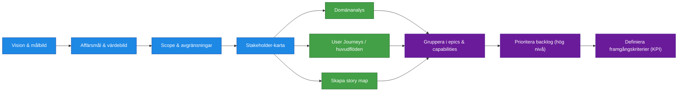

# Processsteg: Kravställning / Problemdefinition

## Syfte
Syftet med denna fas är att skapa en gemensam och strukturerad förståelse för vilket problem som ska lösas och vilket värde lösningen ska skapa.  
Fasen säkerställer att organisationen bygger **rätt produkt** genom att tydliggöra målbild, behov, omfattning och användarflöden innan tekniska lösningar tas fram.

Resultatet av fasen ska vara en **strukturerad och prioriterad funktionsbild** som kan ligga till grund för arkitekturarbete och planering av leveranser.

---

# Delprocesser och aktiviteter

## Delprocess 1: Vision och målbild
En beskrivning av den framtida produkten och vilket värde den ska skapa för verksamheten och användarna.  
Beskriver varför produkten ska byggas och vilken effekt den ska ha.

Innehåll kan exempelvis inkludera:
- Problembeskrivning
- Produktvision
- Förväntade verksamhetsförbättringar
- Målgrupper och användartyper

Aktiviteter:
- definiera problembild
- formulera produktvision
- beskriva målgrupper
- definiera värde och effekt
---

## Delprocess 2: Affärsmål och värdebild
Definierar vilka konkreta mål produkten ska uppnå.

Exempel:
- Effektivisering
- Kostnadsbesparingar
- Intäktsökning
- Kvalitetsförbättring
- Riskreducering

Aktiviteter:
- identifiera affärsmål
- definiera värdemått
- definiera framgångskriterier

Innehåller även hur värdet ska kunna mätas.

---

## Delprocess 3: Scope och avgränsningar
Beskriver vad som ingår i initiativet och vad som **inte** ingår.

Syfte:
- skapa tydlighet
- undvika scope creep
- säkerställa realistisk leverans

Aktiviteter:
- samla funktionella behov
- formulera user stories
- säkerställa tydliga acceptance criteria
- NFR identifieras på hög nivå här, och detaljeras senare i målarkitekturen

---

## Delprocess 4: Stakeholder-karta
Identifierar alla viktiga intressenter kring produkten.

Kan inkludera:
- verksamhetsansvariga
- användargrupper
- tekniska organisationer
- externa beroenden

Aktiviteter:
- identifiera berörda organisationer
- kartlägga ansvar
- definiera involvering
- identifiera tekniska och organisatoriska beroenden

Beskriver även deras roll, ansvar och intresse i lösningen.

---

## Delprocess 5: Domänanalys
Analys av verksamhetsområdet och de centrala begrepp och processer som produkten ska stödja.

Innehåller exempelvis:
- centrala objekt
- verksamhetsregler
- viktiga relationer
- informationsflöden

Aktiviteter:
- analysera verksamhetsprocesser
- identifiera centrala objekt
- definiera verksamhetsregler
---

## Delprocess 6: User Journeys / huvudflöden
Beskriver hur användare interagerar med lösningen för att uppnå ett mål.

Syfte:
- förstå användarbeteenden
- identifiera funktionella behov
- skapa en helhetsbild av användarupplevelsen

Aktiviteter:
- identifiera användartyper
- beskriva användarflöden
- identifiera smärtpunkter
---

## Delprocess 7: Skapa en strukturerad story map
En strukturerad karta över funktionaliteten i produkten.

Story mapping organiserar funktionalitet i:

- aktiviteter
- användarsteg
- funktionella behov

Aktiviteter:
- strukturera funktionalitet
- organisera stories i aktiviteter och steg
- visualisera produktens funktionella struktur

Det ger en helhetsbild över produkten och fungerar som bas för planering av leveranser.

---

## Delprocess 8: Gruppera i epics och capabilities
User stories grupperas i större funktionella områden.

Typisk struktur:

Capability  
→ Epic  
→ User Stories

Aktiviteter:
- gruppera user stories
- identifiera funktionella områden
- skapa hanterbara backlog-strukturer

Detta gör backloggen mer hanterbar och möjlig att planera på strategisk nivå.

---

## Delprocess 9: Prioritera produktbacklog (hög nivå)
En initial prioritering av funktionaliteten baserat på:

- affärsvärde
- användarnytta
- risk
- beroenden

Aktiviteter:
- prioritera funktioner
- identifiera högt värde
- identifiera riskreducerande funktioner

Prioriteringen används senare för att planera MVP och leveranser.

---

## Delprocess 10: Definiera framgångskriterier (KPI:er)
Definierar hur initiativets framgång ska mätas.

Exempel:
- användning
- tidsbesparing
- minskade fel
- förbättrad kundupplevelse

Aktiviteter:
- definiera KPI:er
- definiera uppföljningsmetoder
- dokumentera mätbara mål

---

# Resultat från fasen

När fasen är klar ska följande finnas:

- tydlig produktvision
- definierade affärsmål
- kartlagda användarflöden
- strukturerad story map
- epics och capabilities
- prioriterad backlog
- definierade KPI:er

Detta utgör grunden för nästa fas: **Målarkitektur / Lösningsarkitektur**.