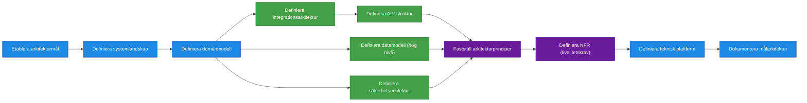

# Processsteg: Målarkitektur / Lösningsarkitektur

## Syfte
Definiera **hur den färdiga lösningen ska se ut när hela produkten är implementerad**.  
Målarkitekturen skapar en gemensam teknisk och strukturell målbild som styr utvecklingen och säkerställer att lösningen blir:

- skalbar
- säker
- hållbar över tid
- möjlig att vidareutveckla

Fasen säkerställer att funktionella krav kan realiseras i en sammanhängande teknisk lösning och att alla viktiga tekniska beslut fattas innan större implementation påbörjas.

Resultatet är en **målarkitektur som beskriver system, komponenter, integrationer och tekniska principer för den färdiga produkten**.

---

# Delprocesser och aktiviteter

## Delprocess 1: Etablera arkitekturmål

Aktiviteter:
- analysera krav från fas 1
- definiera arkitekturmål
- identifiera viktiga designprinciper

---

## Delprocess 2: Definiera systemlandskap
En övergripande arkitekturöversikt över alla system och komponenter som ingår i lösningen.

Visar exempelvis:
- huvudsystem
- externa system
- integrationer
- gränssnitt mellan komponenter

Aktiviteter:
- identifiera systemkomponenter
- definiera systemansvar
- definiera gränssnitt mellan system

Syftet är att skapa en **helhetsbild av systemlandskapet**.

---

## Delprocess 3: Definiera domänmodell
En modell över de centrala begrepp och objekt som systemet hanterar.

Innehåller exempelvis:
- affärsobjekt
- relationer mellan objekt
- centrala verksamhetsregler

Aktiviteter:
- identifiera centrala affärsobjekt
- definiera relationer
- etablera gemensam begreppsmodell

Domänmodellen fungerar som **gemensamt språk mellan verksamhet och teknik**.

---

## Delprocess 4: Definiera integrationsarkitektur
Beskriver hur lösningen integrerar med andra system.

Innehåller exempelvis:
- integrationspunkter
- integrationsmönster
- datautbyte
- ansvarsfördelning mellan system

Aktiviteter:
- identifiera externa system
- definiera integrationspunkter
- välja integrationsmönster
- definiera API-struktur
- definiera kontrakt mellan system
- definiera API-standarder

---

## Delprocess 5: Definiera datamodell
En övergripande modell över hur information struktureras och lagras i lösningen.

Beskriver exempelvis:
- centrala datatyper
- informationsrelationer
- datalagringsprinciper

Men även
- dataägarskap & livscykel
- dataklassning & skydd

Aktiviteter:
- identifiera datatyper
- definiera informationsrelationer
- definiera lagringsstrategi

---

## Delprocess 6: Definiera säkerhetsarkitektur
Definierar hur lösningen skyddar information och användare.

Innehåller exempelvis:
- autentisering
- auktorisation
- identitetshantering
- dataskydd
- säkerhetsprinciper

Aktiviteter:
- definiera autentisering
- definiera auktorisation
- definiera dataskydd

---

## Delprocess 7: Fastställ gällande arkitekturprinciper
Ett antal vägledande principer för hur lösningen ska designas och utvecklas.

Exempel:
- lös koppling mellan komponenter
- Eventdrivet API 
- säkerhet som standard
- automatiserad deployment

---

## Delprocess 8: Definiera Non-Functional Requirements (NFR)
Definierar de tekniska kvalitetskrav som lösningen måste uppfylla.

Exempel:
- prestanda
- skalbarhet
- tillgänglighet
- säkerhet
- loggning
- övervakning
- driftbarhet

Aktiviteter:
- definiera prestandakrav
- definiera tillgänglighetskrav
- definiera skalbarhetskrav
- definiera övervakning och loggning

---

## Delprocess 9: Definiera teknisk plattform

Aktiviteter:
- välja teknologier
- definiera utvecklingsplattform
- definiera driftplattform

## Delprocess 10: Dokumentera målarkitektur

Aktiviteter:
- sammanställa arkitekturartefakter
- dokumentera arkitekturprinciper
- kommunicera målarkitekturen till utvecklingsteam

---

## Delprocess 11:Identifiera arkitektur-risks och antaganden
I en målarkitektur vill man minst lyfta:

- kritiska tekniska risker
- osäkerheter
- antaganden som påverkar målbilden

Aktiviteter
- Identifiera arkitektur­risker och kritiska antaganden
- 
- Aktiviteter: identifiera risker, bedöma påverkan, dokumentera antaganden.”

---

# Resultat från fasen

När fasen är klar ska följande finnas:

- definierat systemlandskap
- tydlig domänmodell
- integrationsarkitektur
- datamodell på hög nivå
- API-struktur
- säkerhetsarkitektur
- teknisk plattform
- definierade non-functional requirements
- dokumenterad målarkitektur

Detta utgör grunden för nästa fas: **Leveransstrategi och roadmap**.