# Processsteg: Roadmap / Leveransstrategi

## Syfte
Syftet med denna fas är att definiera **hur lösningen ska byggas och levereras stegvis** så att verksamheten kan börja få värde tidigt.

I denna fas omvandlas den funktionella helhetsbilden från fas 1 och målarkitekturen från fas 2 till en **konkret leveransplan**. Funktionen bryts ned i leveransbara paket som kan utvecklas och tas i bruk successivt.

Målet är att:

- identifiera **MVP (Minimum Viable Product)**
- definiera **leveranspaket / releaser**
- prioritera funktionalitet baserat på värde och risk
- identifiera tekniska beroenden
- skapa en **produktroadmap**

Resultatet ska vara en **tydlig plan för hur produkten levereras stegvis**.

```mermaid
flowchart LR

    %% SEKVENTIELL HUVUDFLÖDE
    A1["Delprocess 1: Skapa MVP"] --> A2["Delprocess 2: Strukturera story map till leveranspaket"]
    A2 --> A3["Delprocess 6: Identifiera tekniska beroenden"]
    A3 --> A4["Delprocess 5: Prioritera funktionalitet"]
    A4 --> A5["Delprocess 3: Skapa releaseplan"]
    A5 --> A6["Delprocess 4: Skapa produktroadmap"]

    %% VISUELL PARALLELLITET
    %% Prioritering kan påbörjas innan beroenden är KLARA, men inte avslutas.
    A3 -. delvis parallellt .-> A4

    %% STYLING
    classDef seq fill:#1e88e5,stroke:#0d47a1,color:#fff;
    classDef par fill:#43a047,stroke:#1b5e20,color:#fff;

    class A1,A2,A3,A4,A5,A6 seq;
```

---

# Delprocesser och aktiviteter

## Delprocess 1: Skapa MVP:er
Definition av den minsta version av produkten som ger värde och kan börja användas.

MVP ska:
- leverera tydligt verksamhetsvärde
- vara användbar i verklig verksamhet
- skapa en grund för vidare utveckling

Aktiviteter:
- identifiera minsta användbara produkt
- säkerställa att MVP levererar verksamhetsvärde
- säkerställa teknisk genomförbarhet

---

## Delprocess 2: Strukturera Story Map till leveranspaket
En uppdelning av funktionaliteten i logiska leveranspaket som kan implementeras och levereras successivt.

Varje leveranspaket ska:
- implementer del eller helhet av en MVP
- vara tekniskt genomförbart
- kunna användas självständigt eller som del av en växande lösning

Aktiviteter:
- analysera story map från fas 1
- identifiera funktionella grupper
- skapa logiska leveranspaket
- bedöm utvecklingskapacitet

---

## Delprocess 3:Skapa releaseplan
En plan för hur leveranspaket ska implementeras och släppas.

Den beskriver:
- ordning mellan releaser
- innehåll per release
- beroenden mellan leveranser

Aktiviteter:
- definiera ordning mellan leveranser
- planera innehåll per release
- säkerställa realistisk leveransplan

---

## Delprocess 4: Skapa produktroadmap
En visuell plan över hur produkten utvecklas över tid.

Roadmapen visar:
- större leveranssteg
- strategisk riktning
- planerad utveckling av produkten

Aktiviteter:
- visualisera leveranser över tid
- definiera strategiska steg
- kommunicera produktens utvecklingsplan
---

## Delprocess 5: Prioritera funktionalitet
En strukturerad backlog där epics och user stories prioriterats baserat på:

- affärsvärde
- användarnytta
- tekniska beroenden
- riskreducering

Aktiviteter:
- prioritera funktioner baserat på värde
- identifiera riskreducerande leveranser
- balansera verksamhetsvärde och tekniska behov

Denna backlog används som grund för kommande iterationer.

---

## Delprocess 6: Identifiera tekniska beroenden
En dokumentation av tekniska beroenden mellan funktioner, system och komponenter.

Syftet är att:
- undvika blockerande situationer
- planera tekniskt arbete i rätt ordning
- säkerställa stabil utveckling

Aktiviteter:
- analysera beroenden mellan funktioner
- analysera integrationsberoenden
- identifiera tekniska förutsättningar

---

# Resultat från fasen

När fasen är klar ska följande finnas:

- tydligt definierad MVP
- definierade leveranspaket
- prioriterad backlog
- identifierade tekniska beroenden
- releaseplan
- produktroadmap

Detta utgör grunden för nästa fas: **Kontinuerlig leverans**.