# Processsteg: Roadmap / Leveransstrategi

## Syfte
Syftet med denna fas är att definiera **hur lösningen ska byggas och levereras stegvis** så att verksamheten kan börja få värde tidigt.  
I denna fas omvandlas den funktionella helhetsbilden från fas 1 och målarkitekturen från fas 2 till en **konkret leveransplan**. Funktionen bryts ned i leveransbara paket som kan utvecklas och tas i bruk successivt.

Målet är att:
- identifiera **MVP (Minimum Viable Product)**
- definiera **leveranspaket / releaser**
- prioritera funktionalitet baserat på värde och risk
- identifiera tekniska beroenden
- skapa en **produktroadmap**

Resultatet ska vara en **tydlig plan för hur produkten levereras stegvis**.

```mermaid
flowchart LR

    %% SEKVENTIELL HUVUDFLÖDE
    A1["Delprocess 1: Skapa MVP"] --> A2["Delprocess 2: Strukturera story map till leveranspaket"]
    A2 --> A3["Delprocess 6: Identifiera tekniska beroenden"]
    A3 --> A4["Delprocess 5: Prioritera funktionalitet"]
    A4 --> A5["Delprocess 3: Skapa releaseplan"]
    A5 --> A6["Delprocess 4: Skapa produktroadmap"]

    %% VISUELL PARALLELLITET
    %% Prioritering kan påbörjas innan beroenden är KLARA, men inte avslutas.
    A3 -. delvis parallellt .-> A4

    %% STYLING
    classDef seq fill:#1e88e5,stroke:#0d47a1,color:#fff;
    classDef par fill:#43a047,stroke:#1b5e20,color:#fff;

    class A1,A2,A3,A4,A5,A6 seq;
```

---

# Delprocesser och aktiviteter

## Delprocess 1: Skapa MVP
Definition av den minsta version av produkten som ger värde och kan börja användas.  
MVP ska leverera tydligt verksamhetsvärde och utgöra grund för vidare utveckling.

➡ **Se ../SOP/Roadmap/01_skapa_mvp.md.**

---

## Delprocess 2: Strukturera story map till leveranspaket
En uppdelning av funktionaliteten i logiska leveranspaket som kan implementeras och levereras successivt.

Varje leveranspaket ska:
- ge verksamhetsvärde  
- vara tekniskt genomförbart  
- kunna användas självständigt eller som del av en växande lösning  

➡ **Se ../SOP/Roadmap/02_strukturera_story_map_till_leveranspaket.md.**

---

## Delprocess 3: Skapa releaseplan
En plan för hur leveranspaket ska implementeras och släppas.  
Beskriver ordning mellan releaser, innehåll och beroenden.

➡ **Se ../SOP/Roadmap/03_skapa_releaseplan.md.**

---

## Delprocess 4: Skapa produktroadmap
En visuell plan över hur produkten utvecklas över tid.  
Roadmapen visar större leveranssteg, strategisk riktning och planerad utveckling.

➡ **Se ../SOP/Roadmap/04_skapa_produktroadmap.md.**

---

## Delprocess 5: Prioritera funktionalitet
En strukturerad prioritering av funktionalitet baserat på affärsvärde, användarnytta, tekniska beroenden och risk.

➡ **Se ../SOP/Roadmap/05_prioritera_funktionalitet.md.**

---

## Delprocess 6: Identifiera tekniska beroenden
Dokumentation av tekniska beroenden mellan funktioner, system och komponenter.  
Syftar till att planera arbete i rätt ordning och undvika blockeringar.

➡ **Se ../SOP/Roadmap/06_identifiera_tekniska_beroenden.md.**

---

# Resultat från fasen
När fasen är klar ska följande finnas:

- tydligt definierad MVP  
- definierade leveranspaket  
- prioriterad backlog  
- identifierade tekniska beroenden  
- releaseplan  
- produktroadmap  

Detta utgör grunden för nästa fas: **Kontinuerlig leverans**.