# Processsteg: Leverans / Implementation

## Syfte
Syftet med denna fas är att bygga, testa, leverera och förbättra produkten i korta iterationer.  
Fokus är att kontinuerligt skapa värde, säkerställa kvalitet och möjliggöra snabba förbättringar baserat på feedback.

Varje iteration ska resultera i fungerande, testad och potentiellt produktionssättbar funktionalitet.

```mermaid
flowchart LR

    %% ===== SEKVENTIELL START: PLANERING =====
    A1["Delprocess 1: Backlog refinement"] --> A2["Delprocess 2: Sprintplanering"]
    A2 --> B1["Delprocess 3: Utveckling"]
    B1 --> B2["Delprocess 4: Kodgranskning"]

    %% ===== TESTNING ÄR SEKVENTIELLT EFTER KOD =====
    B2 --> B3["Delprocess 5: Test"]

    %% ===== CI/CD-KEDJA =====
    B3 --> C1["Delprocess 6: Integration & bygg"]

    %% ===== DEMO =====
    C1 --> D1["Delprocess 7: Demo"]

    %% ===== RELEASE =====
    D1 --> E1["Delprocess 8: Release"]

    %% ===== DEPLOYMENT =====
    E1 --> F1["Delprocess 9: Deployments"]

    %% ===== DOKUMENTATION (KAN KÖRAS PARALLELLT EFTER RELEASE) =====
    E1 -. parallellt .-> E2["Delprocess 10: Uppdatera dokumentation"]
    F1 -. parallellt .-> E2

    %% ===== RETROSPEKTIV / FÖRBÄTTRING =====
    E2 --> G1["Delprocess 11: Uppföljning & förbättring"]
    F1 --> G1

    %% ===== SLUT: SIGNAL FRAMÅT TILL REPEAT =====
    G1 --> H1["Input till nästa processsteg (Repeat)"]

    %% ===== STYLING =====
    classDef seq fill:#1e88e5,stroke:#0d47a1,color:#fff;
    classDef par fill:#43a047,stroke:#1b5e20,color:#fff;
    classDef converge fill:#6a1b9a,stroke:#4a148c,color:#fff;

    class A1,A2,B1,B2,B3,C1,D1,E1,F1,G1,H1 seq;
    class E2 par;
```

---

# Delprocesser och arbetsmoment

## Delprocess 1: Backlog refinement
Förtydligar och bryter ner kommande arbete så att teamet kan planera och leverera effektivt.

➡ **Se ../SOP/Leverans/01_backlog_refinement.md.**

---

## Delprocess 2: Sprintplanering
Planerar vilket arbete teamet ska leverera i nästa iteration baserat på prioritet och kapacitet.

➡ **Se ../SOP/Leverans/02_sprintplanering.md.**

---

## Delprocess 3: Utveckling
Implementerar funktionalitet enligt user stories, design och arkitektur.

➡ **Se ../SOP/Leverans/03_utveckling.md.**

---

## Delprocess 4: Kodgranskning
Säkerställer kvalitet, riktlinjer och arkitekturell följsamhet innan funktionalitet går vidare till test.

➡ **Se ../SOP/Leverans/04_kodgranskning.md.**

---

## Delprocess 5: Test
Verifierar att funktionalitet fungerar som avsett och uppfyller acceptanskriterier och kvalitetskrav.

➡ **Se ../SOP/Leverans/05_test.md.**

---

## Delprocess 6: Integration och bygg (CI/CD)
Säkerställer att systemet byggs, integreras och fungerar korrekt i CI/CD‑kedjan.

➡ **Se ../SOP/Leverans/06_integration_och_bygg.md.**

---

## Delprocess 7: Demo
Visar levererad funktionalitet för verksamheten, samlar feedback och säkerställer värde.

➡ **Se ../SOP/Leverans/07_demo.md.**

---

## Delprocess 8: Release
Paketera och godkänner releaser för vidare leverans till test-, stage- eller produktionsmiljö.

➡ **Se ../SOP/Leverans/08_release.md.**

---

## Delprocess 9: Deployments
Genomför installationer av lösningen i olika miljöer och verifierar att driftsättningen är korrekt.

➡ **Se ../SOP/Leverans/09_deployments.md.**

---

## Delprocess 10: Uppdatera dokumentation
Håller teknisk och funktionell dokumentation uppdaterad efter varje leverans.

➡ **Se ../SOP/Leverans/10_uppdatera_dokumentation.md.**

---

## Delprocess 11: Uppföljning och förbättring
Reflekterar över iterationens process och resultat för att förbättra nästa leveranscykel.

➡ **Se ../SOP/Leverans/11_uppfoljning_och_forbattring.md.**

---

# Resultat från fasen
Denna fas pågår kontinuerligt och resulterar löpande i:

- implementerad funktionalitet  
- levererade releaser  
- förbättrad produkt  
- uppdaterad dokumentation  
- insamlad användar- och verksamhetsfeedback  

Så länge det finns **prioriterade behov i backloggen och finansiering för utveckling** fortsätter denna fas som en iterativ process.