# Processsteg: Leverans / Implementation

## Syfte
Syftet med denna fas är att bygga, testa, leverera och förbättra produkten i korta iterationer.  
Fokus är att kontinuerligt skapa värde, säkerställa kvalitet och möjliggöra snabba förbättringar baserat på feedback.

Varje iteration ska resultera i fungerande, testad och potentiellt produktionssättbar funktionalitet.

```mermaid
flowchart LR

    %% ===== SEKVENTIELL START: PLANERING =====
    A1["Delprocess 1: Backlog refinement"] --> A2["Delprocess 2: Sprintplanering"]
    A2 --> B1["Delprocess 3: Utveckling"]
    B1 --> B2["Delprocess 4: Kodgranskning"]

    %% ===== TESTNING ÄR SEKVENTIELLT EFTER KOD =====
    B2 --> B3["Delprocess 5: Test"]

    %% ===== CI/CD-KEDJA =====
    B3 --> C1["Delprocess 6: Integration & bygg"]

    %% ===== DEMO =====
    C1 --> D1["Delprocess 7: Demo"]

    %% ===== RELEASE =====
    D1 --> E1["Delprocess 8: Release"]

    %% ===== DEPLOYMENT =====
    E1 --> F1["Delprocess 9: Deployments"]

    %% ===== DOKUMENTATION (KAN KÖRAS PARALLELLT EFTER RELEASE) =====
    E1 -. parallellt .-> E2["Delprocess 10: Uppdatera dokumentation"]
    F1 -. parallellt .-> E2

    %% ===== RETROSPEKTIV / FÖRBÄTTRING =====
    E2 --> G1["Delprocess 11: Uppföljning & förbättring"]
    F1 --> G1

    %% ===== SLUT: SIGNAL FRAMÅT TILL REPEAT =====
    G1 --> H1["Input till nästa processsteg (Repeat)"]

    %% ===== STYLING =====
    classDef seq fill:#1e88e5,stroke:#0d47a1,color:#fff;
    classDef par fill:#43a047,stroke:#1b5e20,color:#fff;
    classDef converge fill:#6a1b9a,stroke:#4a148c,color:#fff;

    class A1,A2,B1,B2,B3,C1,D1,E1,F1,G1,H1 seq;
    class E2 par;
```

---

# Delprocesser och aktiviteter

## Delprocess 1: Backlog refinement
Förbereda och tydliggöra kommande arbete så att teamet kan planera och leverera effektivt.

### Aktiviteter
- förtydliga user stories  
- bryta ned funktionalitet i mindre uppgifter  
- definiera acceptance criteria  
- uppskatta arbetsinsats  

---

## Delprocess 2: Sprintplanering
Planera vad teamet ska leverera under nästa iteration baserat på prioriteringar och kapacitet.

### Aktiviteter
- välja stories från backlog  
- definiera sprintmål  
- planera genomförande  
- Bedöma teamets kapacitet/velocity

---

## Delprocess 3: Utveckling
Implementera funktionalitet enligt user stories, design och arkitektur.

### Aktiviteter
- implementera funktionalitet  
- skriva kod  
- implementera integrationer  
- uppdatera tekniska komponenter  

---

## Delprocess 4: Kodgranskning
Säkerställa kodkvalitet, standarder och att arkitekturprinciper följs.

### Aktiviteter
- granska kod  
- kvalitetssäkra implementation  
- kontrollera efterlevnad av arkitekturprinciper  
- ge förbättringsförslag  

---

## Delprocess 5: Test
Verifiera att funktionalitet fungerar som avsett och uppfyller krav och NFR.

### Aktiviteter
- genomföra tester (manuella och automatiserade)  
- verifiera funktionalitet  
- automatisera tester  
- rapportera och hantera buggar  

---

## Delprocess 6: Integration och bygg
Bygga systemet och säkerställa att integrationer fungerar i CI/CD-kedjan.

### Aktiviteter
- köra CI/CD-pipelines  
- bygga systemet  
- verifiera integrationer  

---

## Delprocess 7: Demo
Visa levererad funktionalitet för verksamheten och samla feedback.

### Aktiviteter
- demonstrera funktionalitet  
- samla feedback  
- identifiera förbättringar  

---

## Delprocess 8: Release
Förbereda och leverera ny funktionalitet till produktion eller stagingmiljö.

### Aktiviteter
- paketera release  
- skapa release notes  
- genomföra deployment  

---

## Delprocess 9: Deployments
Installera och verifiera lösningen i utvecklings-, test-, staging- och produktionsmiljöer.

### Aktiviteter
- genomföra deployment i olika miljöer  
- säkerställa automatiserad driftsättning  
- verifiera att miljöerna fungerar efter deploy  

---

## Delprocess 10: Uppdatera dokumentation
Hålla dokumentation aktuell i samband med leveranser och förändringar.

### Aktiviteter
- uppdatera systemdokumentation  
- uppdatera API‑dokumentation  
- uppdatera användardokumentation  
- dokumentera integrationer och driftinstruktioner  

---

## Delprocess 11: Uppföljning och förbättring
Reflektera över arbetssättet och förbättra teamets process inför nästa iteration.

### Aktiviteter
- genomföra retrospektiv  
- analysera iterationens resultat  
- identifiera förbättringar  
- justera arbetssätt och prioriteringar  

---

# Resultat från fasen
Fasen resulterar kontinuerligt i:

- producerad, testad och levererad funktionalitet  
- releaser redo för användning  
- förbättrad produkt  
- uppdaterad dokumentation  
- insamlad feedback  
- iterativ förbättring av teamets arbetssätt  

Fasen fortsätter så länge det finns **prioriterade behov i backloggen** och **finansiering för utveckling**.