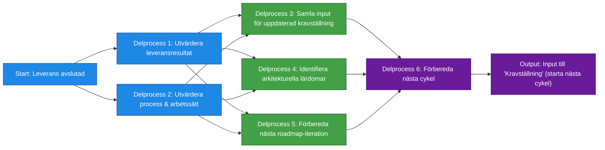

# Processsteg: Repeat / Reflektion & Justering

## Syfte
Syftet med denna fas är att avsluta den genomförda leveransen, samla in lärdomar och förbereda nästa cykel av processen.  
Fasen säkerställer att erfarenheter, feedback och resultat omsätts till **insikter** som används i nästa steg:

Kravställning → Målarkitektur → Roadmap → Leverans → Repeat → …

Repeat-fasen **uppdaterar inte** roadmap, målarkitektur eller krav i detalj – den skapar endast *input och förbättringspunkter* som tas med till processsteg 1 igen.

---

# Delprocesser och aktiviteter

## Delprocess 1: Utvärdera leveransresultat
Sammanställer vad som faktiskt levererades och jämför utfallet med planerat värde, förväntningar och funktionalitet.  
Fokuserar på att förstå om releasen skapat det verksamhetsvärde som var tänkt.

➡ **Se ../SOP/Repeat/01_utvardera_leveransresultat.md.**

---

## Delprocess 2: Utvärdera process och arbetssätt
Reflekterar över hur teamet arbetade under iterationen och vad som behöver förbättras inför nästa cykel.  
Identiferar hinder, flaskhalsar och kvalitetsavvikelser i arbetssättet.

➡ **Se ../SOP/Repeat/02_utvardera_process_och_arbetssatt.md.**

---

## Delprocess 3: Samla input för uppdaterad kravställning
Samlar övergripande insikter och behov som ska tas vidare till nästa Kravställningsfas.  
Inkluderar feedback från verksamhet, användare, team och tidigare leveranser.

➡ **Se ../SOP/Repeat/03_samla_input_for_uppdaterad_kravstallning.md.**

---

## Delprocess 4: Identifiera arkitekturella lärdomar
Identifierar tekniska och arkitekturella insikter som påverkat leveransen och som ska användas i nästa iteration av Målarkitekturen.  
Fokuserar på tekniska problem, avvikelser från principer och arkitekturella förbättringsområden.

➡ **Se ../SOP/Repeat/04_identifiera_arkitekturella_lardomar.md.**

---

## Delprocess 5: Förbereda nästa roadmap‑iteration
Samlar insikter om nya eller förändrade beroenden, risker och förutsättningar som behöver hanteras i nästa roadmap‑arbete.  
Detta steg innebär inte att roadmap uppdateras – endast att material för nästa uppdatering förbereds.

➡ **Se ../SOP/Repeat/05_forbereda_nasta_roadmap_iteration.md.**

---

## Delprocess 6: Förbereda nästa cykel
Säkerställer att alla förutsättningar är på plats inför starten av nästa processcykel.  
Samlar ihop all input till ett gemensamt startunderlag för Kravställning i nästa iteration.

➡ **Se ../SOP/Repeat/06_forbereda_nasta_cykel.md.**

---

# Resultat från fasen
När Repeat är avslutat finns:

- sammanställda lärdomar  
- förbättringspunkter för arbetssätt och team  
- övergripande kravinsikter som startmaterial för nästa kravställning  
- tekniska och arkitekturella insikter som input till nästa målarkitektur  
- hög‑nivå‑justeringar som tas med till nästa roadmap  
- alla förutsättningar klara för att börja nästa cykel  

Fasen leder direkt tillbaka till **Kravställning** i den cirkulära processen.