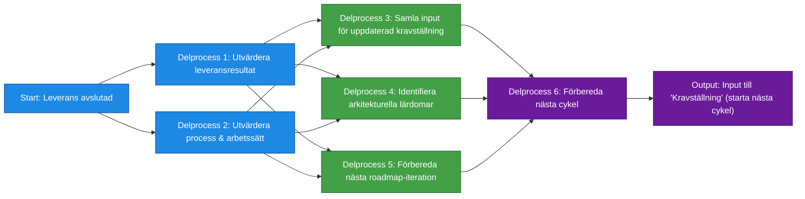

# Processsteg: Repeat / Reflektion & Justering

## Syfte
Syftet med denna fas är att avsluta den genomförda leveransen, samla in lärdomar och förbereda nästa cykel av processen.  
Fasen säkerställer att erfarenheter, feedback och resultat omsätts till **insikter** som används i nästa steg:

Kravställning → Målarkitektur → Roadmap → Leverans → Repeat → …

Repeat-fasen **uppdaterar inte** roadmap, målarkitektur eller krav i detalj – den skapar endast *input och förbättringspunkter* som tas med till processsteg 1 igen.

---

# Delprocesser och aktiviteter

## Delprocess 1: Utvärdera leveransresultat
Sammanställa vad som faktiskt levererades och jämföra mot plan och förväntat värde.

### Aktiviteter
- utvärdera om värdet i releasen uppnåddes  
- analysera gap mellan planerat och levererat  
- samla in verksamhetsfeedback  
- identifiera förbättringsområden i funktionalitet  

---

## Delprocess 2: Utvärdera process och arbetssätt
Reflektera över hur teamet arbetade och vilka förbättringar som behövs inför nästa cykel.

### Aktiviteter
- genomföra retrospektiv  
- identifiera hinder, flaskhalsar och förbättringspunkter  
- besluta om konkreta förbättringsåtgärder till nästa cykel  

---

## Delprocess 3: Samla input för uppdaterad kravställning
Skapa grundmaterial som ska användas i nästa Kravställning – på en övergripande nivå.

### Aktiviteter
- dokumentera feedback som behöver översättas till nya krav  
- identifiera nya behov från användare/verksamhet  
- markera element i backloggen som behöver revideras i nästa fas  
- notera ej levererad funktionalitet som ska omformuleras eller prioriteras om  

---

## Delprocess 4: Identifiera arkitekturella lärdomar
Notera eventuella tekniska lärdomar som ska användas i nästa Målarkitektur-fas.

### Aktiviteter
- identifiera tekniska problem som uppstod  
- notera avvikelser från arkitekturprinciper  
- dokumentera arkitekturella konsekvenser  
- samla input till nästa målarkitekturrunda (ingen uppdatering sker här)  

---

## Delprocess 5: Förbereda nästa roadmap-iteration
Identifiera på hög nivå om planen behöver omtag eller justering i nästa Roadmap-fas.

### Aktiviteter
- notera förändrade beroenden  
- markera behov av replanering i nästa cykel  
- samla in risker och blockare att ta med till roadmap-arbetet  

---

## Delprocess 6: Förbereda nästa cykel
Säkerställa att nästa cykel kan starta smidigt i Kravställning.

### Aktiviteter
- definiera mål på övergripande nivå inför nästa cykel  
- kommunicera viktiga insikter från leveransen  
- säkerställa att team och verksamhet är alignment för fas 1  
- samla allt material som ingår i ”startskottet” för Kravställning  

---

# Resultat från fasen
När Repeat är avslutat finns:

- sammanställda lärdomar  
- förbättringspunkter för arbetssätt och team  
- övergripande kravinsikter som startmaterial för nästa Kravställning  
- tekniska och arkitekturella insikter som input till nästa Målarkitektur  
- hög-nivå-justeringar att ta med till nästa Roadmap  
- alla förutsättningar klara för att börja nästa cykel

Fasen leder direkt tillbaka till **Kravställning** i den cirkulära processen.