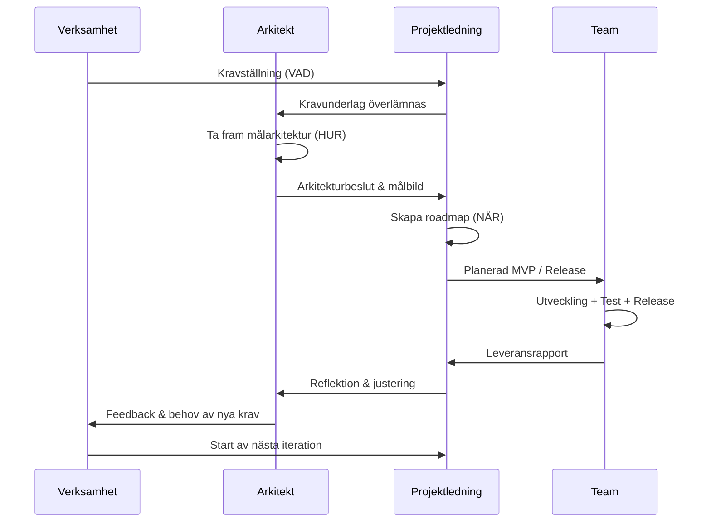

## Process i form av sekvens
Komplettas när vi har SOP:er för varje roll

```mermaid
sequenceDiagram
    participant V as Verksamhet
    participant A as Arkitekt
    participant P as Projektledning
    participant T as Team

    V->>P: Kravställning (VAD)
    P->>A: Kravunderlag överlämnas
    A->>A: Ta fram målarkitektur (HUR)
    A->>P: Arkitekturbeslut & målbild
    P->>P: Skapa roadmap (NÄR)
    P->>T: Planerad MVP / Release
    T->>T: Utveckling + Test + Release
    T->>P: Leveransrapport
    P->>A: Reflektion & justering
    A->>V: Feedback & behov av nya krav
    V->>P: Start av nästa iteration
```
