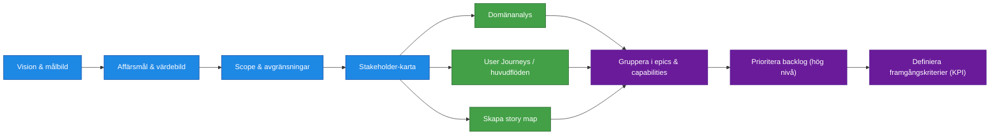
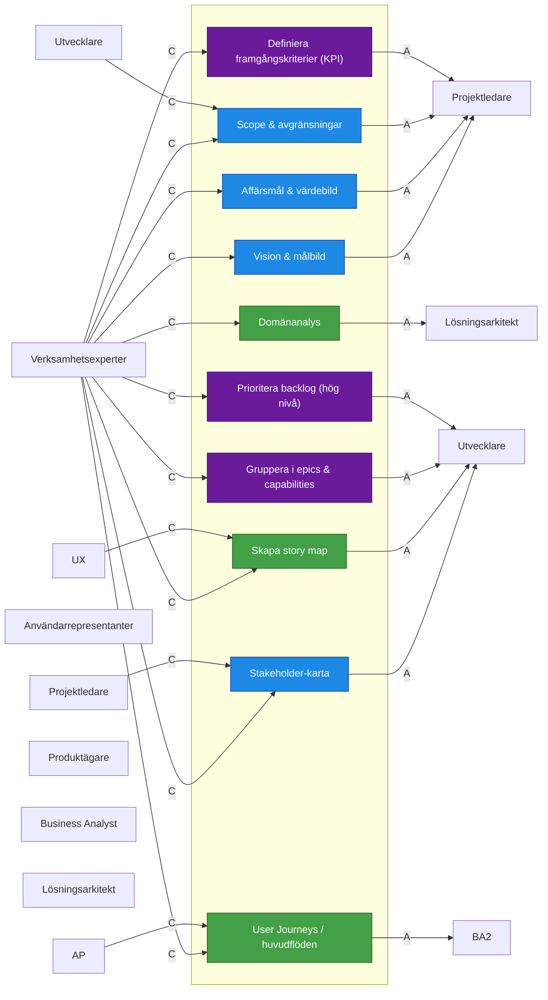
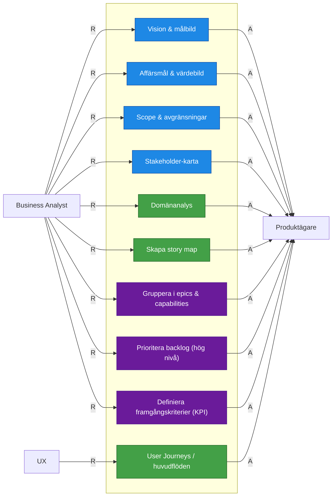

| Aktivitet                          | R                     | A            | C                                           | I                |
| ---------------------------------- | --------------------- | ------------ | ------------------------------------------- | ---------------- |
| Vision & målbild                   | Business Analyst      | Produktägare | Verksamhetsexperter                         | Projektledare    |
| Affärsmål & värdebild              | Business Analyst      | Produktägare | Verksamhetsexperter                         | Projektledare    |
| Scope & avgränsningar              | Business Analyst      | Produktägare | Verksamhetsexperter, Utvecklare             | Projektledare    |
| Stakeholder-karta                  | Business Analyst      | Produktägare | Verksamhetsexperter, Projektledare          | Utvecklare       |
| Domänanalys                        | Business Analyst      | Produktägare | Verksamhetsexperter                         | Lösningsarkitekt |
| User Journeys / huvudflöden        | UX / Service Designer | Produktägare | Verksamhetsexperter, Användarrepresentanter | Business Analyst |
| Skapa story map                    | Business Analyst      | Produktägare | UX, Verksamhetsexperter                     | Utvecklare       |
| Gruppera i epics & capabilities    | Business Analyst      | Produktägare | Verksamhetsexperter                         | Utvecklare       |
| Prioritera backlog (hög nivå)      | Business Analyst      | Produktägare | Verksamhetsexperter                         | Utvecklare       |
| Definiera framgångskriterier (KPI) | Business Analyst      | Produktägare | Verksamhetsexperter                         | Projektledare    |

