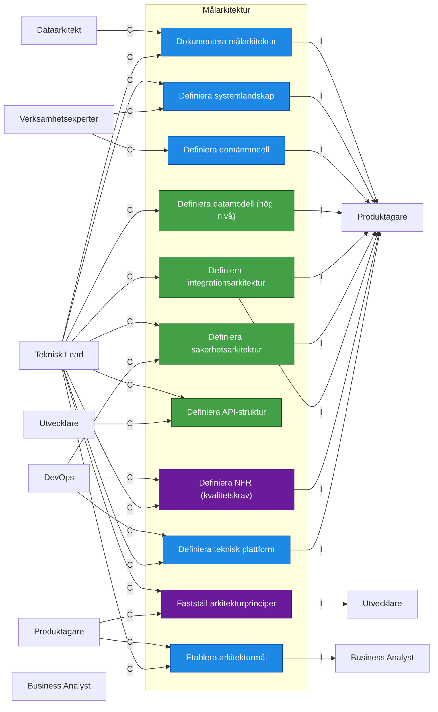
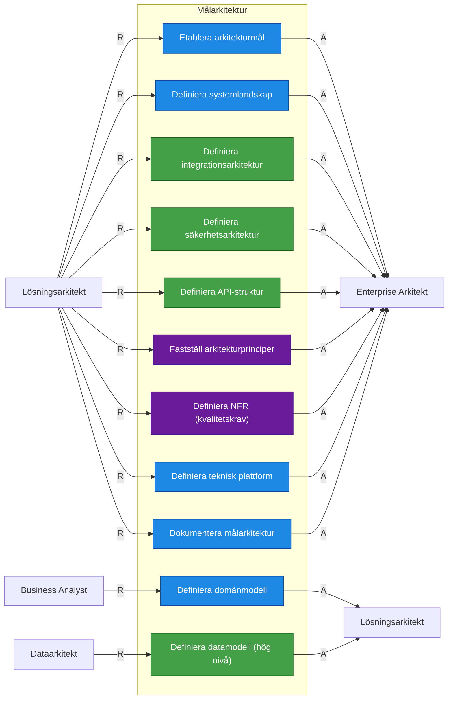

| Aktivitet                        | R                | A                   | C                                 | I                |
| -------------------------------- | ---------------- | ------------------- | --------------------------------- | ---------------- |
| Etablera arkitekturmål           | Lösningsarkitekt | Enterprise Arkitekt | Produktägare, Teknisk Lead        | Business Analyst |
| Definiera systemlandskap         | Lösningsarkitekt | Enterprise Arkitekt | Teknisk Lead, Verksamhetsexperter | Produktägare     |
| Definiera domänmodell            | Business Analyst | Lösningsarkitekt    | Verksamhetsexperter               | Produktägare     |
| Definiera integrationsarkitektur | Lösningsarkitekt | Enterprise Arkitekt | Teknisk Lead                      | Produktägare     |
| Definiera API-struktur           | Lösningsarkitekt | Enterprise Arkitekt | Teknisk Lead, Utvecklare          | Produktägare     |
| Definiera datamodell (hög nivå)  | Dataarkitekt     | Lösningsarkitekt    | Teknisk Lead                      | Produktägare     |
| Definiera säkerhetsarkitektur    | Lösningsarkitekt | Enterprise Arkitekt | Teknisk Lead, DevOps              | Produktägare     |
| Fastställ arkitekturprinciper    | Lösningsarkitekt | Enterprise Arkitekt | Teknisk Lead, Produktägare        | Utvecklare       |
| Definiera NFR (kvalitetskrav)    | Lösningsarkitekt | Enterprise Arkitekt | DevOps, Teknisk Lead              | Produktägare     |
| Definiera teknisk plattform      | Lösningsarkitekt | Enterprise Arkitekt | DevOps, Teknisk Lead              | Produktägare     |
| Dokumentera målarkitektur        | Lösningsarkitekt | Enterprise Arkitekt | Dataarkitekt, Teknisk Lead        | Produktägare     |

