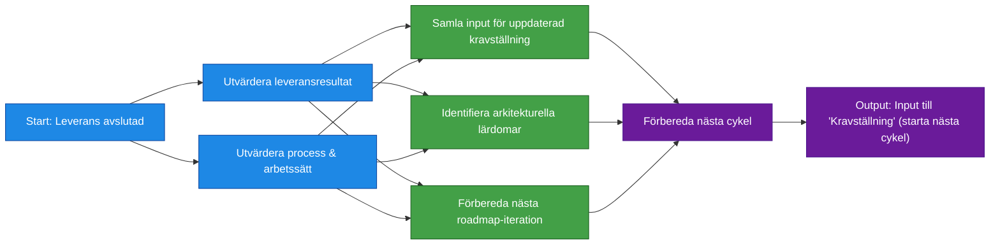
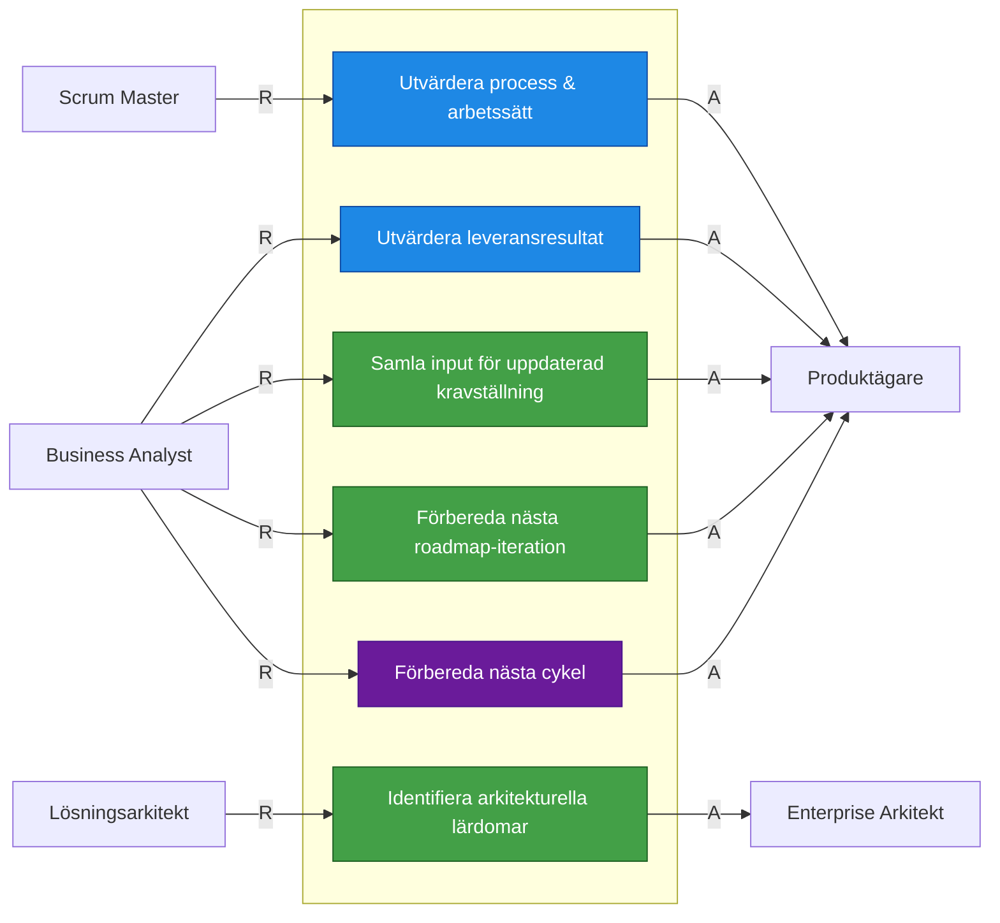
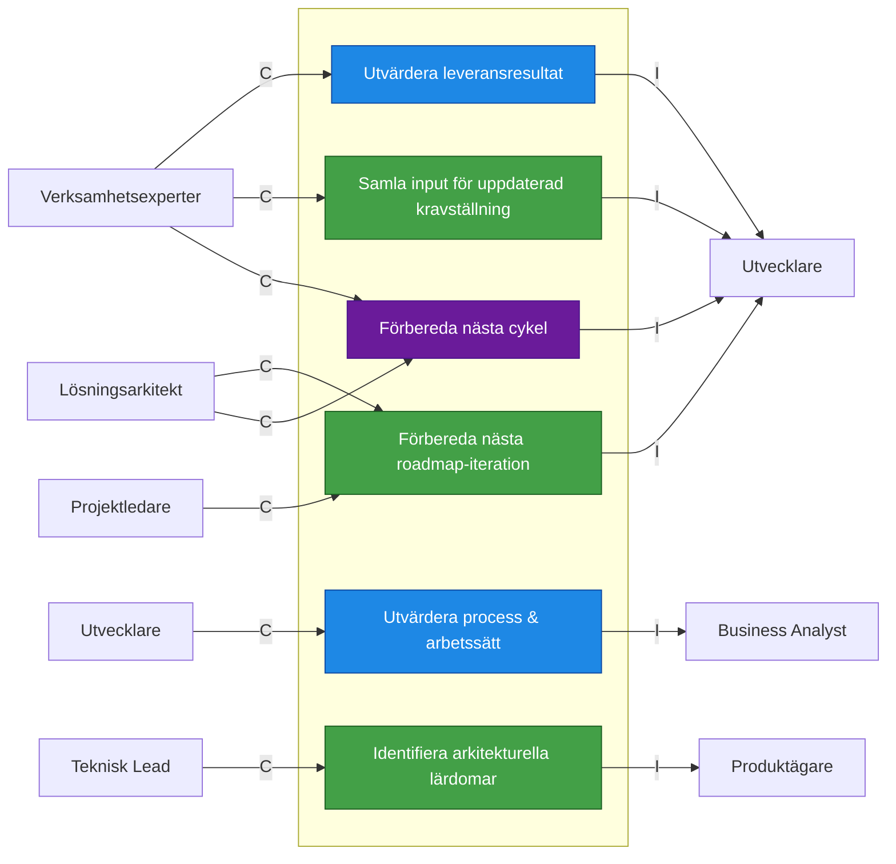

# Roller nödvändiga för Repeat / Reflektion & Justering

## RACI tabell

| Aktivitet                                | R                | A                   | C                                     | I                |
| ---------------------------------------- | ---------------- | ------------------- | ------------------------------------- | ---------------- |
| Utvärdera leveransresultat               | Business Analyst | Produktägare        | Verksamhetsexperter                   | Utvecklare       |
| Utvärdera process och arbetssätt         | Scrum Master     | Produktägare        | Utvecklare                            | Business Analyst |
| Samla input för uppdaterad kravställning | Business Analyst | Produktägare        | Verksamhetsexperter                   | Utvecklare       |
| Identifiera arkitekturella lärdomar      | Lösningsarkitekt | Enterprise Arkitekt | Teknisk Lead                          | Produktägare     |
| Förbereda nästa roadmap-iteration        | Business Analyst | Produktägare        | Lösningsarkitekt, Projektledare       | Utvecklare       |
| Förbereda nästa cykel                    | Business Analyst | Produktägare        | Lösningsarkitekt, Verksamhetsexperter | Utvecklare       |

## RA-Diagram: Vem utför och vem godkänner

## CI-Diagram: Vilka stöttar i och vilka informeras
