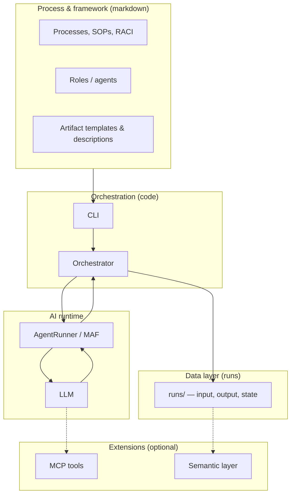

# 🚀 Agent-Driven Workflow Framework

**A framework for orchestrating development workflows with agent-driven process execution**

Agent-Driven Workflow Framework helps organizations structure, coordinate and execute software development work using agents and text-driven processes.

It connects **process, roles, and execution** into a repeatable framework for documentation, planning, delivery and continuous learning.

---

## 🎯 Purpose

To create a **clear, scalable and executable model** for how organizations move from:

> **Idea → Architecture → Plan → Build → Learn → Repeat**

The framework is designed to:
- Reduce ambiguity in development processes  
- Make work **explicit, structured and traceable**  
- Enable **agent-driven execution of defined workflows**  
- Support continuous improvement through iterative cycles  

---

## 🔄 Core Process

ValueStream OS is built around a circular delivery model:

```
WHAT → HOW → WHEN → BUILD → LEARN → WHAT → ...
```

| Step | Focus | Outcome |
|------|------|--------|
| **Kravställning** | What do we need? | Requirements (VAD) |
| **Målarkitektur** | How should it work? | Target architecture (HUR) |
| **Roadmap** | When do we deliver? | Plan (NÄR) |
| **Leverans** | Build & release | Product increment, release package and documentation |
| **Repeat** | Learn & adjust | Evaluation, insights and cycle start brief |

---

## 🧩 From framework to model (simplified)

High-level picture of how **markdown framework**, **orchestration**, **LLM execution**, and **run data** fit together. This is intentionally generalized for context; a more detailed view with extra components is in [`setup/architecture/05-ai-architecture.md`](setup/architecture/05-ai-architecture.md).



---

## 🧠 Key Concepts

### 1. SOP-driven execution
All work is defined as **Standard Operating Procedures (SOPs)**:
- Clear purpose  
- Defined input/output  
- Explicit steps  
- Connected to roles (RACI)  

👉 SOPs are the bridge between **process and execution**

---

### 2. Roles → Agents
Each role in the process can be implemented as an **agent**:
- Product Owner  
- Architect  
- Developer  
- QA  
- etc.  

Agents follow SOPs to produce consistent, high-quality output.

---

### 3. Artifacts as first-class citizens
Everything is built around **artifacts**:
- Requirements  
- Architecture descriptions  
- Roadmaps  
- Code  
- Learnings  

Artifacts are:
- Structured  
- Traceable  
- Reusable  

---

### 4. Text-first architecture
The system is intentionally **text-based**:
- Markdown-driven  
- Transparent  
- Easy to version and inspect  

This makes it ideal for:
- AI/agent interaction  
- Collaboration  
- Incremental evolution  

---

## 🏗️ Repository Structure

```text
framework/ → Framework variants, navigation and documentation (the "brain")
src/ → Agents, orchestration, capabilities (the "engine")
runs/ → Local private execution state (not versioned)
setup/ → Development environment and working guidelines
```

### Current structure notes

- `framework/standard/` is the main framework variant.
- `framework/light/` is a lighter parallel variant.
- `runs/` is a local runtime workspace and must not be committed.
- Shared or published run results belong in the separate sibling repository `../valuestream-os-data`.
- Some code still supports legacy `docs/` lookup for backward compatibility.

Start here:

- Framework: `framework/standard/INDEX.md`
- Shared run results: `../valuestream-os-data`
- Setup and contribution guidance: `setup/README.md`

## 📘 Development Guidelines

See:
`setup/guidelines/standards.md`
`setup/guidelines/framework-development-guidelines.md`