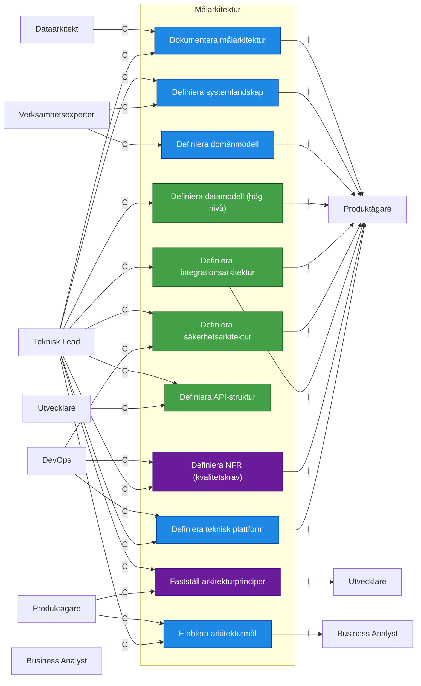
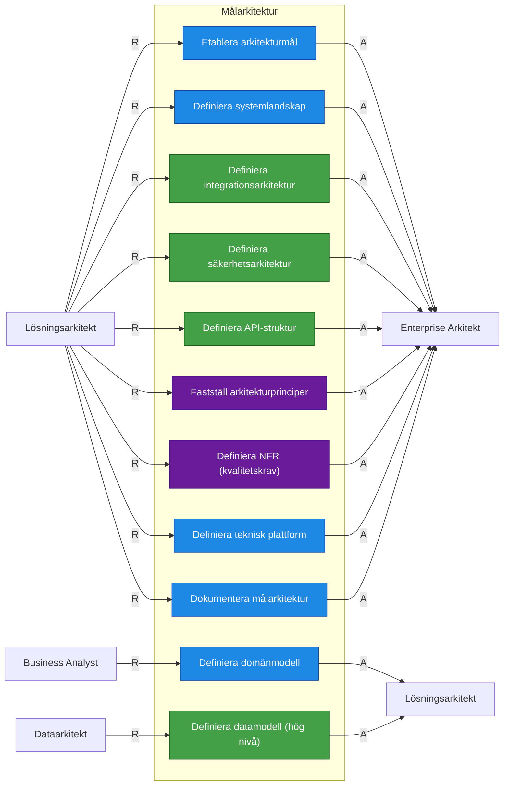

# Roller nödvändiga för att ta fram Målarkitektur

## RACI tabell

| Artifact                     | R                | A                   | C                          | I                |
| ---------------------------- | ---------------- | ------------------- | -------------------------- | ---------------- |
| Arkitekturmål                | Lösningsarkitekt | Enterprise Arkitekt | Produktägare               | Business Analyst |
| Arkitekturprinciper          | Lösningsarkitekt | Enterprise Arkitekt | Produktägare, Teknisk Lead | Business Analyst |
| Systemlandskap               | Lösningsarkitekt | Enterprise Arkitekt | Teknisk Lead               | Produktägare     |
| Domänmodell                  | Business Analyst | Lösningsarkitekt    | Verksamhetsexperter        | Produktägare     |
| Begreppsmodell               | Business Analyst | Lösningsarkitekt    | Verksamhetsexperter        | Produktägare     |
| Integrationsarkitektur       | Lösningsarkitekt | Enterprise Arkitekt | Teknisk Lead               | Produktägare     |
| Integrationspunkter          | Lösningsarkitekt | Enterprise Arkitekt | Teknisk Lead               | Produktägare     |
| API-specifikation            | Lösningsarkitekt | Enterprise Arkitekt | Teknisk Lead               | Produktägare     |
| Datamodell                   | Dataarkitekt     | Lösningsarkitekt    | Teknisk Lead               | Produktägare     |
| Dataägarskap                 | Dataarkitekt     | Lösningsarkitekt    | Teknisk Lead               | Produktägare     |
| Säkerhetsarkitektur          | Lösningsarkitekt | Enterprise Arkitekt | Teknisk Lead               | Produktägare     |
| Säkerhetsprinciper           | Lösningsarkitekt | Enterprise Arkitekt | Teknisk Lead               | Produktägare     |
| Icke-funktionella krav (NFR) | Lösningsarkitekt | Enterprise Arkitekt | DevOps                     | Produktägare     |
| Teknisk plattform            | Lösningsarkitekt | Enterprise Arkitekt | DevOps                     | Produktägare     |
| Målarkitektur                | Lösningsarkitekt | Enterprise Arkitekt | DevOps ,Dataarkitekt       | Produktägare     |

