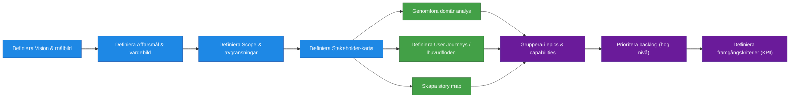

# Processsteg: Kravställning / Problemdefinition

## Syfte

Syftet med denna fas är att skapa en gemensam och strukturerad förståelse för vilket problem som ska lösas och vilket värde lösningen ska skapa.
Fasen säkerställer att organisationen bygger **rätt produkt** genom att tydliggöra målbild, behov, omfattning och användarflöden innan tekniska lösningar tas fram.

Resultatet av fasen ska vara en **strukturerad och prioriterad funktionsbild** som kan ligga till grund för arkitekturarbete och planering av leveranser.

---

# Delprocesser och aktiviteter

## Delprocess 1: Vision och målbild

En beskrivning av den framtida produkten och vilket värde den ska skapa för verksamheten och användarna.
Beskriver varför produkten ska byggas och vilken effekt den ska ha.

Innehåll kan exempelvis inkludera:

- Problembeskrivning
- Produktvision
- Förväntade verksamhetsförbättringar
- Målgrupper och användartyper

➡ **Se [SOP 1: Vision och målbild](../SOP/1.Kravställning/01_vision_och_malbild.md).**

---

## Delprocess 2: Affärsmål och värdebild

Definierar vilka konkreta mål produkten ska uppnå.

Exempel:

- Effektivisering
- Kostnadsbesparingar
- Intäktsökning
- Kvalitetsförbättring
- Riskreducering

Innehåller även hur värdet ska kunna mätas.

➡ **Se [SOP 2: Affärsmål och värdebild](../SOP/1.Kravställning/02_affarsmal_och_vardebild.md).**

---

## Delprocess 3: Scope och avgränsningar

Beskriver vad som ingår i initiativet och vad som **inte** ingår.

Syfte:

- skapa tydlighet
- undvika scope creep
- säkerställa realistisk leverans

➡ **Se [SOP 3: Scope och avgränsningar](../SOP/1.Kravställning/03_scope_och_avgransningar.md).**

---

## Delprocess 4: Stakeholder‑karta

Identifierar alla viktiga intressenter kring produkten.

Kan inkludera:

- verksamhetsansvariga
- användargrupper
- tekniska organisationer
- externa beroenden

➡ **Se [SOP 4: Stakeholder‑karta](../SOP/1.Kravställning/04_stakeholderkarta.md).**

---

## Delprocess 5: Create User Stories

Strukturering av behov till user stories baserat på mål, aktörer och identifierade problem, för att skapa en första sammanhängande bild av önskad funktionalitet.

Innehåller exempelvis:

identifiering av aktörer (användartyper)
formulering av user stories (”Som [aktör] vill jag…”)
koppling till affärsmål och värde
gruppering och konsolidering av liknande behov
initial prioritering på hög nivå

➡ **Se [SOP 5: Create User Stories](../SOP/1.Kravställning/05_create_user_stories.md).**

---

## Delprocess 6: Domänanalys

Analys av verksamhetsområdet och de centrala begrepp och processer som produkten ska stödja.

Innehåller exempelvis:

- centrala objekt
- viktiga relationer
- informationsflöden

➡ **Se [SOP 6: Domänanalys](../SOP/1.Kravställning/06_domananalys.md).**

---

## Delprocess 7: User Journeys / huvudflöden

Beskriver hur användare interagerar med lösningen för att uppnå ett mål.

Syfte:

- förstå användarbeteenden
- identifiera funktionella behov
- skapa en helhetsbild av användarupplevelsen

➡ **Se [SOP 7: User Journeys](../SOP/1.Kravställning/07_user_journeys.md).**

---

## Delprocess 8: Skapa en strukturerad story map

En strukturerad karta över funktionaliteten i produkten.

Story mapping organiserar funktionalitet i:

- aktiviteter
- användarsteg
- funktionella behov

➡ **Se [SOP 8: Skapa Story Map](../SOP/1.Kravställning/08_skapa_story_map.md).**

---

## Delprocess 9: Gruppera i epics och capabilities

User stories grupperas i större funktionella områden.

Struktur:

- Capability
- → Epic
- → User Stories

➡ **Se [SOP 9: Gruppera i epics & capabilities](../SOP/1.Kravställning/09_gruppera_i_epics_och_capabilities.md).**

---

## Delprocess 10: Prioritera produktbacklog (hög nivå)

En initial prioritering av funktionaliteten baserat på:

- affärsvärde
- användarnytta
- risk
- beroenden

➡ **Se [SOP 10: Prioritera backlog](../SOP/1.Kravställning/10_prioritera_backlog.md).**

---

## Delprocess 11: Definiera framgångskriterier (KPI:er)

Definierar hur initiativets framgång ska mätas.

Exempel:

- användning
- tidsbesparing
- minskade fel
- förbättrad kundupplevelse

➡ **Se [SOP 11: Framgångskriterier (KPI)](../SOP/1.Kravställning/11_definiera_framgangskriterier.md).**

---

# Resultat från fasen

När fasen är klar ska följande finnas:

- tydlig produktvision
- definierade affärsmål
- kartlagda användarflöden
- strukturerad story map
- epics och capabilities
- prioriterad backlog
- definierade KPI:er

Detta utgör grunden för nästa fas: **Målarkitektur / Lösningsarkitektur**.
