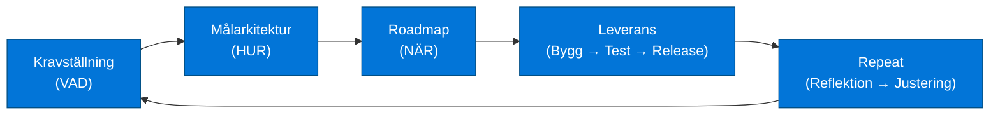

# Produkt- och Arkitekturprocess (Cirkulär Modell)

En repeterbar, hållbar och skalbar process för att gå från krav → målbild → plan → leverans → lärande → ny iteration.

## Översiktlig processkarta

➡ **Se även: [Flödesdiagram för personas](Process_sequence.md).**

---

## 1. Kravställning (VAD)

**Vad är det vi vill ha i framtiden?**

Syfte: Fånga behov, mål och önskad funktionalitet från verksamheten.

Innehåller:

- User stories och epics
- Icke-funktionella krav (NFR)
- Verksamhetsmål
- Avgränsningar
- Problemdefinition

➡ **Läs mer: [1. Kravställning](1.%20Kravställning.md).**

---

## 2. Målarkitektur (HUR)

**Hur ska lösningen se ut när den är färdig?**

Syfte: Definiera den framtida arkitekturen – tekniskt och strukturellt.

Innehåller:

- Systemkarta / Lösningslandskap
- Domänmodell
- Integrationsarkitektur
- Datamodell (hög nivå)
- Säkerhetsarkitektur
- Arkitekturprinciper

➡ **Läs mer: [2. Målarkitektur](2.%20Målarkitektur.md).**

---

## 3. Roadmap (NÄR)

**När och i vilken ordning ska vi leverera?**

Syfte: Planera och prioritera leveranser mot målbilden.

Innehåller:

- MVP-definition
- Prioriterade leveransvågor
- Releaseplan (v1, v2, v3…)
- Tekniska och organisatoriska beroenden
- Resursbehov

➡ **Läs mer: [3. Roadmap](3.%20Roadmap.md).**

---

## 4. Leverans (BYGG → TEST → RELEASE)

**Operativ leverans av nästa MVP eller release.**

Syfte: Förverkliga roadmapen och leverera värde till verksamheten.

Innehåller:

- Lösningsdesign per komponent
- Utveckling
- Integration
- Test
- Driftsättning
- Dokumentation

➡ **Läs mer: [4. Leverans](4.%20Leverans.md).**

---

## 5. Repeat – Reflektion & Justering (CHECK → ACT)

**Vad lärde vi oss? Vad behöver justeras?**

Syfte: Säkerställa kontinuerlig förbättring av både produkt och arkitektur.

Innehåller:

- Lärdomar från senaste leveransen
- Justering av målarkitektur (vid behov)
- Uppdatering av kravbild
- Omprioritering av roadmap

➡ **Läs mer: [5. Repeat](5.%20Repeat.md).**

---

## 6. Goto 1 – Starta nästa cykel

Processen fortsätter cirkulärt:

**VAD → HUR → NÄR → LEVERERA → REFLEKTERA → VAD → …**

Detta säkerställer att lösningen utvecklas i takt med verksamhetens behov och tekniska lärdomar.

---

## Ramverkskoppling

| Fas           | Arkitekturspråk  | Ramverksmappning                                    |
| ------------- | ---------------- | --------------------------------------------------- |
| Kravställning | VAD / Problemrum | TOGAF Vision, SAFe Backlog                          |
| Målarkitektur | HUR / TO-BE      | TOGAF Target Architecture, SAFe Architecture Runway |
| Roadmap       | NÄR / Plan       | TOGAF Migration Planning, SAFe PI-plan              |
| Leverans      | DO               | DevOps, Kanban, SAFe ART                            |
| Repeat        | Check → Act      | PDCA, Continuous Architecture                       |
