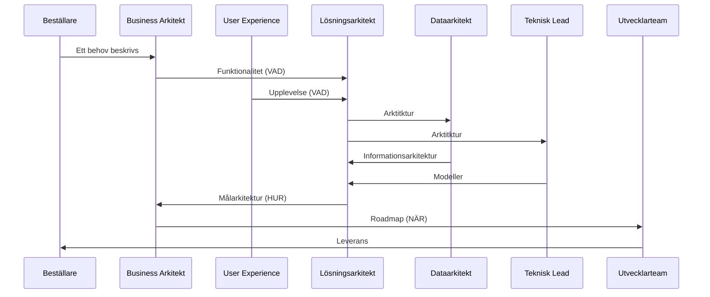

## Processflöde

Övergripande bild för olika personas/agenter

```mermaid
sequenceDiagram
    participant B as Beställare
    participant BA as Business Arkitekt
    participant UX as User Experience

    participant LA as Lösningsarkitekt
    participant DA as Dataarkitekt

    participant TL as Teknisk Lead

    participant U as Utvecklarteam

    B->>BA: Ett behov beskrivs
    BA->>LA: Funktionalitet (VAD)
    UX->>LA: Upplevelse (VAD)
    LA->>DA: Arktitktur

    LA->>TL: Arktitktur
    DA->>LA: Informationsarkitektur
    TL->>LA: Modeller

    LA->>BA: Målarkitektur (HUR)

    BA->>U: Roadmap (NÄR)
    U->>B: Leverans

```
