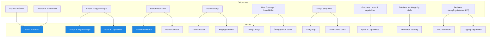

# Artifakter från processsteg

## Kravställning

```mermaid
flowchart TB
    subgraph "Delprocess"
        D1["Vision & målbild"]
        D2["Affärsmål & värdebild"]
        D3["Scope & avgränsningar"]
        D4["Stakeholder-karta"]
        D5["Domänanalys"]
        D6["User Journeys / huvudflöden"]
        D7["Skapa Story Map"]
        D8["Gruppera i epics & capabilities"]
        D9["Prioritera backlog (hög nivå)"]
        D0["Definiera framgångskriterier (KPI)"]
    end

    subgraph "Artifact"
        A1["Vision & målbild"]
        A2["Scope & avgränsningar"]
        A3["Epics & Capabilities"]
        A4["Stakeholderkarta"]
        A5["Beroendekarta"]
        A6["Domänmodell"]
        A7["Begreppsmodell"]
        A8["User journeys"]
        A9["Övergripande behov"]
        A10["Story map"]
        A11["Funktionella block"]
        A12["Epics & Capabilities"]
        A13["Prioriterad backlog"]
        A14["KPI / värdemått"]
        A15["Uppföljningsmodell"]
    end


    D1 --> A1
    D2 --> A1
    D3 --> A2
    D3 --> A3
    D4 --> A4
    D4 --> A5
    D5 --> A6
    D5 --> A7
    D6 --> A8
    D6 --> A9
    D7 --> A10
    D7 --> A11
    D8 --> A12
    D9 --> A13
    D0 --> A14
    D0 --> A15


    %% STYLING
    classDef seq fill:#1e88e5,stroke:#0d47a1,color:#fff;
    classDef par fill:#43a047,stroke:#1b5e20,color:#fff;
    classDef slut fill:#6a1b9a,stroke:#4a148c,color:#fff;

    class A1,A2,A3,A4 seq;
    class B1,B2,B3 par;
    class C1,C2,C3 slut;
```
