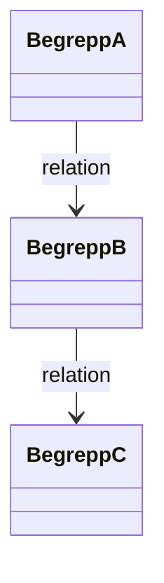

# Begreppsmodell

## Metadata
| Fält | Värde |
|------|------|
| Artifakttyp | Krav & Arkitektur |
| Ägare | Business Analyst |
| Version | 1.0 |
| Datum | YYYY-MM-DD |
| Status | Utkast / Pågående / Klar |

---

## 1. Översikt
Beskriv syftet med begreppsmodellen och koppling till övriga artefakter.

- Referens till Vision & Målbild:
- Referens till Scope & Avgränsningar:
- Kort sammanfattning:

---

## 2. Begreppslista (Glossary)
Definiera centrala begrepp.

| Begrepp | Definition | Kontext | Synonymer | Kommentar |
|----------|------------|---------|-----------|-----------|
| | | | | |
| | | | | |

---

## 3. Relationer mellan begrepp
Beskriv hur begrepp hänger ihop.

---

## 4. Struktur / Gruppindelning
Gruppera begrepp i logiska domäner.

| Domän | Beskrivning | Begrepp |
|------|-------------|---------|
| | | |
| | | |

---

## 5. Regler & tolkningar
Beskriv viktiga regler kring hur begrepp används.

- Definitioner ska vara entydiga
- Ett begrepp = en betydelse
- Undvik överlappande definitioner

---

## 6. Skillnader & avgränsningar
Tydliggör begrepp som ofta blandas ihop.

| Begrepp A | Begrepp B | Skillnad |
|-----------|-----------|----------|
| | | |
| | | |

---

## 7. Antaganden
Antaganden kopplade till begrepp.

- 
- 

---

## 8. Förändringshistorik
Spåra ändringar i begrepp.

| Datum | Ändring | Ansvarig |
|-------|--------|----------|
| | | |
| | | |

---

## 9. Koppling till vidare arbete
Denna artefakt används som input till:

- Domänmodell
- Datamodell
- API-specifikation
- Krav (user stories)

---

## 10. Godkännande
| Roll | Namn | Datum |
|------|------|--------|
| Produktägare | | |
| Business Analyst | | |
| Lösningsarkitekt | | |
