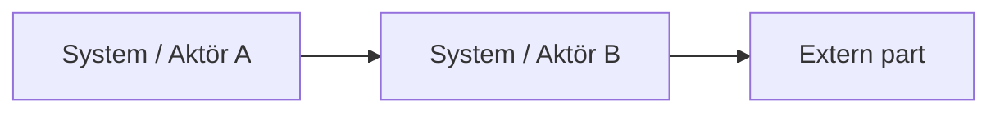

# Beroendekarta

## Metadata
| Fält | Värde |
|------|------|
| Artifakttyp | Krav |
| Ägare | Business Analyst |
| Version | 1.0 |
| Datum | YYYY-MM-DD |
| Status | Utkast / Pågående / Klar |

---

## 1. Översikt
Beskriv syftet med beroendekartan och koppling till övriga artefakter.

- Referens till Vision & Målbild:
- Referens till Scope & Avgränsningar:
- Kort sammanfattning:

---

## 2. Identifierade beroenden
Lista alla identifierade beroenden.

| ID | Typ | Källa | Beroende till | Beskrivning | Kritikalitet (H/M/L) |
|----|-----|------|----------------|-------------|----------------------|
| | | | | | |
| | | | | | |

**Typ kan vara:**
- System
- Organisation
- Funktion
- Extern part

---

## 3. Visualisering (översikt)

---

## 4. Kritiska beroenden
Lyft fram beroenden med hög påverkan.

| Beroende | Risk | Påverkan | Åtgärd |
|----------|------|----------|--------|
| | | | |
| | | | |

---

## 5. Integrationspunkter
Beskriv identifierade integrationer.

| System A | System B | Typ av integration | Beskrivning |
|----------|----------|--------------------|-------------|
| | | | |
| | | | |

---

## 6. Koordineringsbehov
Beskriv behov av samordning mellan aktörer.

| Aktörer | Beskrivning | Frekvens / Timing |
|---------|-------------|-------------------|
| | | |
| | | |

---

## 7. Antaganden
Antaganden kopplade till beroenden.

- 
- 

---

## 8. Risker kopplade till beroenden
| Risk | Påverkan | Åtgärd |
|------|----------|--------|
| | | |
| | | |

---

## 9. Koppling till vidare arbete
Denna artefakt används som input till:

- Målarkitektur
- Roadmap
- Prioritering
- Integrationsdesign

---

## 10. Godkännande
| Roll | Namn | Datum |
|------|------|--------|
| Produktägare | | |
| Business Analyst | | |
| Övriga | | |
