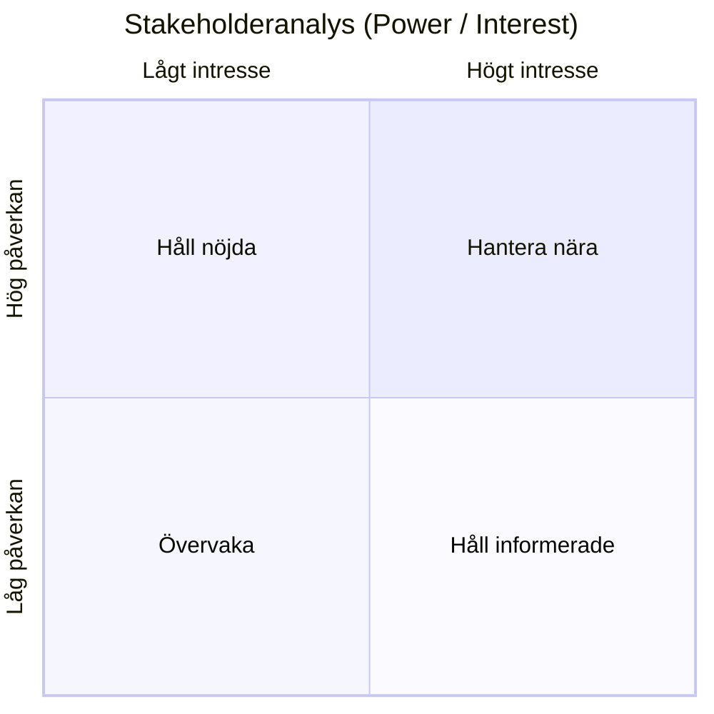

# Stakeholderkarta

## Metadata
| Fält | Värde |
|------|------|
| Artifakttyp | Krav |
| Ägare | Business Analyst |
| Version | 1.0 |
| Datum | YYYY-MM-DD |
| Status | Utkast / Pågående / Klar |

---

## 1. Översikt
Beskriv syftet med stakeholderkartan och koppling till övriga artefakter.

- Referens till Vision & Målbild:
- Referens till Scope & Avgränsningar:
- Kort sammanfattning:

---

## 2. Identifierade intressenter
Lista alla relevanta intressenter.

| Intressent | Typ | Roll | Påverkan (H/M/L) | Intresse (H/M/L) |
|------------|-----|------|------------------|------------------|
| | | | | |
| | | | | |

**Typ kan vara:**
- Intern (verksamhet, IT)
- Extern (kund, partner, myndighet)

---

## 3. Visualisering (Power/Interest)

---

## 4. Behov & förväntningar
Beskriv vad respektive intressent förväntar sig.

| Intressent | Behov | Förväntningar | Risk vid ej uppfyllt |
|------------|-------|----------------|----------------------|
| | | | |
| | | | |

---

## 5. Engagemangsstrategi
Hur varje intressent ska hanteras.

| Intressent | Strategi | Kommunikationssätt | Frekvens |
|------------|----------|--------------------|----------|
| | | | |
| | | | |

---

## 6. Kritiska intressenter
Identifiera de viktigaste intressenterna.

| Intressent | Varför kritisk | Åtgärd |
|------------|----------------|--------|
| | | |
| | | |

---

## 7. Antaganden
Antaganden kopplade till intressenter.

- 
- 

---

## 8. Risker kopplade till intressenter
| Risk | Påverkan | Åtgärd |
|------|----------|--------|
| | | |
| | | |

---

## 9. Koppling till vidare arbete
Denna artefakt används som input till:

- Kravställning
- Prioritering
- UX / Design
- Roadmap

---

## 10. Godkännande
| Roll | Namn | Datum |
|------|------|--------|
| Produktägare | | |
| Business Analyst | | |
| Övriga | | |
