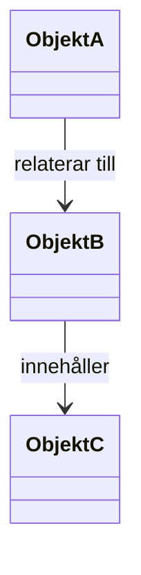

# Domänmodell

## Metadata
| Fält | Värde |
|------|------|
| Artifakttyp | Arkitektur |
| Ägare | Business Analyst |
| Version | 1.0 |
| Datum | YYYY-MM-DD |
| Status | Utkast / Pågående / Klar |

---

## 1. Översikt
Beskriv syftet med domänmodellen och hur den kopplar till begreppsmodell och övriga artefakter.

- Referens till Begreppsmodell:
- Referens till Vision & Målbild:
- Kort sammanfattning:

---

## 2. Domänens omfattning
Beskriv vilken del av verksamheten som modellen täcker.

- Inom scope:
- Utanför scope:
- Viktiga avgränsningar:

---

## 3. Centrala domänobjekt
Identifiera de viktigaste objekten i domänen.

| Domänobjekt | Beskrivning | Ansvar / Ägare | Kommentar |
|-------------|-------------|----------------|-----------|
| | | | |
| | | | |

---

## 4. Relationer mellan domänobjekt
Beskriv hur objekten hänger ihop.

| Från objekt | Relation | Till objekt | Beskrivning |
|-------------|----------|-------------|-------------|
| | | | |
| | | | |

---

## 5. Domänmodell – visuell översikt

---

## 6. Attribut på hög nivå
Beskriv viktiga attribut för respektive objekt på en övergripande nivå.

| Domänobjekt | Viktiga attribut | Kommentar |
|-------------|------------------|-----------|
| | | |
| | | |

---

## 7. Regler och begränsningar
Beskriv regler som påverkar relationer eller objektens livscykel.

- Exempel:
  - Ett objekt kan bara ha en aktiv huvudrelation åt gången
  - Ett objekt måste vara kopplat till minst ett annat objekt
  - Vissa objekt får endast skapas i vissa tillstånd

---

## 8. Livscykler / tillstånd
Beskriv viktiga tillstånd eller förändringar över tid.

| Domänobjekt | Tillstånd / steg | Beskrivning |
|-------------|------------------|-------------|
| | | |
| | | |

---

## 9. Avgränsningar mot andra domäner
Beskriv var denna domän slutar och andra tar vid.

| Annan domän | Gränsdragning | Kommentar |
|-------------|---------------|-----------|
| | | |
| | | |

---

## 10. Antaganden
Antaganden kopplade till domänmodellen.

- 
- 

---

## 11. Risker / öppna frågor
Identifiera osäkerheter eller områden som kräver vidare analys.

| Fråga / Risk | Påverkan | Nästa steg |
|--------------|----------|------------|
| | | |
| | | |

---

## 12. Koppling till vidare arbete
Denna artefakt används som input till:

- Datamodell
- API-specifikation
- Målarkitektur
- Lösningsdesign
- User stories och regler

---

## 13. Godkännande
| Roll | Namn | Datum |
|------|------|--------|
| Business Analyst | | |
| Produktägare | | |
| Lösningsarkitekt | | |
