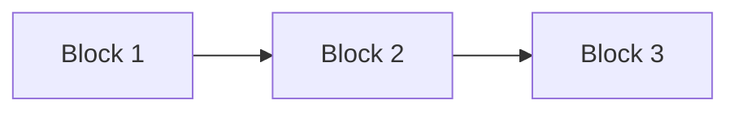

# Funktionella block

## Metadata
| Fält | Värde |
|------|------|
| Artifakttyp | Krav |
| Ägare | Business Analyst |
| Version | 1.0 |
| Datum | YYYY-MM-DD |
| Status | Utkast / Pågående / Klar |

---

## 1. Översikt
Beskriv syftet med funktionella block och koppling till övriga artefakter.

- Referens till Övergripande behov:
- Referens till User Journeys:
- Referens till Epics & Capabilities:
- Kort sammanfattning:

---

## 2. Funktionella block (översikt)
Identifiera och lista blocken.

| Block | Beskrivning | Kopplade behov | Prioritet (H/M/L) |
|-------|-------------|----------------|-------------------|
| | | | |
| | | | |

---

## 3. Struktur per block

### Block: [Namn]

**Beskrivning:**

**Syfte / värde:**

**Kopplade behov:**

**Kopplade epics:**

#### Ingående funktioner
| Funktion | Beskrivning |
|----------|-------------|
| | |
| | |

---

## 4. Visualisering (Story Map struktur)

---

## 5. Samband mellan block
Beskriv beroenden och relationer mellan block.

| Block | Beroende till | Typ | Beskrivning |
|-------|----------------|-----|-------------|
| | | | |
| | | | |

---

## 6. Prioritering
Beskriv hur block prioriteras.

| Block | Prioritet | Motivering |
|-------|------------|------------|
| | | |
| | | |

---

## 7. Avgränsningar
Vad ingår / ingår inte i blocken.

### Ingår
- 

### Ingår inte
- 

---

## 8. Antaganden
- 
- 

---

## 9. Risker
| Risk | Påverkan | Åtgärd |
|------|----------|--------|
| | | |
| | | |

---

## 10. Koppling till vidare arbete
Denna artefakt används som input till:

- Story map
- Epics & Capabilities
- Prioriterad backlog
- Roadmap

---

## 11. Godkännande
| Roll | Namn | Datum |
|------|------|--------|
| Business Analyst | | |
| Produktägare | | |
| UX | | |
