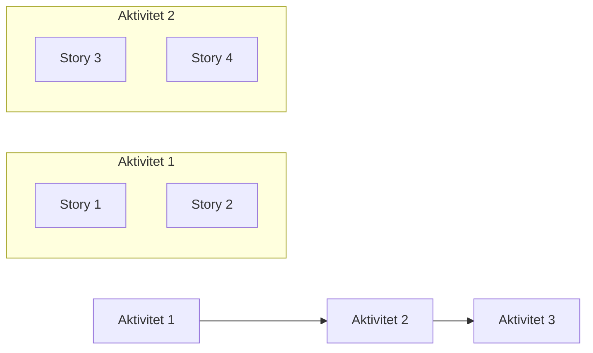

# Story Map

## Metadata
| Fält | Värde |
|------|------|
| Artifakttyp | Krav |
| Ägare | Business Analyst |
| Version | 1.0 |
| Datum | YYYY-MM-DD |
| Status | Utkast / Pågående / Klar |

---

## 1. Översikt
Beskriv syftet med story map och koppling till övriga artefakter.

- Referens till User Journeys:
- Referens till Funktionella block:
- Referens till Epics & Capabilities:
- Kort sammanfattning:

---

## 2. Backbone (Användaraktiviteter)
Identifiera de övergripande aktiviteterna i användarens flöde.

| Aktivitet | Beskrivning |
|-----------|-------------|
| | |
| | |

---

## 3. Struktur (Story Map)

---

## 4. User Stories
Bryt ner aktiviteter i user stories.

| Aktivitet | Story | Beskrivning | Prioritet | MVP (Ja/Nej) |
|-----------|-------|-------------|-----------|---------------|
| | | | | |
| | | | | |

---

## 5. MVP-definition
Identifiera vilka stories som ingår i första leverans.

### MVP scope
- 

### Motivering
- 

---

## 6. Releaseindelning
Planera vidare leveranser.

| Release | Innehåll | Mål |
|---------|----------|-----|
| MVP | | |
| v2 | | |
| v3 | | |

---

## 7. Prioriteringsprinciper
Beskriv hur prioritering sker i story map.

- Affärsvärde
- Användarnytta
- Riskreduktion
- Beroenden

---

## 8. Beroenden
Identifiera beroenden mellan stories eller aktiviteter.

| Story | Beroende till | Beskrivning |
|-------|----------------|-------------|
| | | |
| | | |

---

## 9. Insikter
Sammanfatta viktiga lärdomar från story map.

- 
- 

---

## 10. Koppling till vidare arbete
Denna artefakt används som input till:

- Prioriterad backlog
- Roadmap
- Leveransplanering
- Refinement

---

## 11. Godkännande
| Roll | Namn | Datum |
|------|------|--------|
| Business Analyst | | |
| Produktägare | | |
| UX | | |
