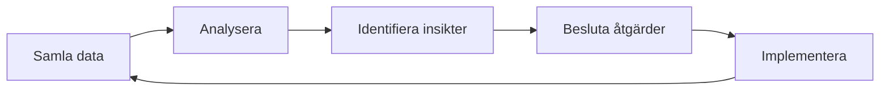

# Uppföljningsmodell

## Metadata
| Fält | Värde |
|------|------|
| Artifakttyp | Krav |
| Ägare | Business Analyst |
| Version | 1.0 |
| Datum | YYYY-MM-DD |
| Status | Utkast / Pågående / Klar |

---

## 1. Översikt
Beskriv syftet med uppföljningsmodellen och koppling till KPI:er.

- Referens till KPI / Värdemått:
- Kort sammanfattning:

---

## 2. Uppföljningsstruktur
Hur uppföljning är organiserad över tid.

| Nivå | Frekvens | Syfte |
|------|----------|-------|
| Operativ | Veckovis | Följa upp aktivitet och progression |
| Taktisk | Månadsvis | Utvärdera trender och resultat |
| Strategisk | Kvartalsvis | Säkerställa måluppfyllelse |

---

## 3. Uppföljningsprocess

---

## 4. KPI-uppföljning
Hur varje KPI följs upp.

| KPI | Frekvens | Ansvarig | Visualisering | Åtgärd vid avvikelse |
|-----|----------|----------|----------------|----------------------|
| | | | | |
| | | | | |

---

## 5. Roller & ansvar
Vem gör vad i uppföljningen.

| Roll | Ansvar |
|------|--------|
| Business Analyst | Samla och analysera data |
| Produktägare | Fatta beslut baserat på insikter |
| Scrum Master | Säkerställa uppföljning i team |
| Team | Agera på identifierade förbättringar |

---

## 6. Datainsamling
Hur data samlas in.

| KPI | Datakälla | Metod | Automatisering |
|-----|-----------|--------|----------------|
| | | | |
| | | | |

---

## 7. Visualisering & rapportering
Hur resultat presenteras.

- Dashboard (real-time)
- Rapport (månatlig/kvartalsvis)
- Möten (review, demo, retrospektiv)

---

## 8. Beslutsmodell
Hur beslut fattas baserat på data.

- Definiera tröskelvärden
- Identifiera avvikelser
- Prioritera åtgärder
- Besluta och följa upp

---

## 9. Kontinuerlig förbättring
Hur lärdomar tas tillvara.

- Input till backlog
- Justering av roadmap
- Uppdatering av KPI:er
- Förbättring av processer

---

## 10. Antaganden
- 
- 

---

## 11. Risker
| Risk | Påverkan | Åtgärd |
|------|----------|--------|
| | | |
| | | |

---

## 12. Koppling till vidare arbete
Denna artefakt används som input till:

- Repeat (reflektion & förbättring)
- Prioriterad backlog
- Roadmap
- Strategiska beslut

---

## 13. Godkännande
| Roll | Namn | Datum |
|------|------|--------|
| Business Analyst | | |
| Produktägare | | |
| Övriga | | |
