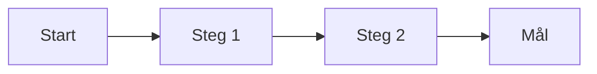

# User Journeys

## Metadata
| Fält | Värde |
|------|------|
| Artifakttyp | Krav |
| Ägare | UX |
| Version | 1.0 |
| Datum | YYYY-MM-DD |
| Status | Utkast / Pågående / Klar |

---

## 1. Översikt
Beskriv syftet med user journeys och koppling till övriga artefakter.

- Referens till Stakeholderkarta:
- Referens till Epics & Capabilities:
- Kort sammanfattning:

---

## 2. Identifierade användartyper
Beskriv vilka användare som omfattas.

| Användartyp | Beskrivning | Mål |
|-------------|-------------|-----|
| | | |
| | | |

---

## 3. User Journeys (översikt)

---

## 4. Detaljerade user journeys

### Journey: [Namn]

**Användartyp:**

**Scenario:**

**Mål:**

#### Flöde
| Steg | Handling | Touchpoint | System | Upplevelse |
|------|----------|------------|--------|-------------|
| 1 | | | | |
| 2 | | | | |
| 3 | | | | |

#### Smärtpunkter (Pain points)
- 
- 

#### Möjligheter (Opportunities)
- 
- 

---

## 5. Viktiga insikter
Sammanfatta centrala lärdomar från journeys.

- 
- 

---

## 6. UX-principer (utifrån journeys)
Härled designprinciper baserat på insikter.

- Enkelhet
- Tydlighet
- Effektivitet
- Feedback till användare

---

## 7. Koppling till krav och design
Denna artefakt används som input till:

- Story map
- UX-design / wireframes
- Prioritering av funktioner
- Epics och user stories

---

## 8. Antaganden
- 
- 

---

## 9. Risker
| Risk | Påverkan | Åtgärd |
|------|----------|--------|
| | | |
| | | |

---

## 10. Godkännande
| Roll | Namn | Datum |
|------|------|--------|
| UX | | |
| Produktägare | | |
| Business Analyst | | |
