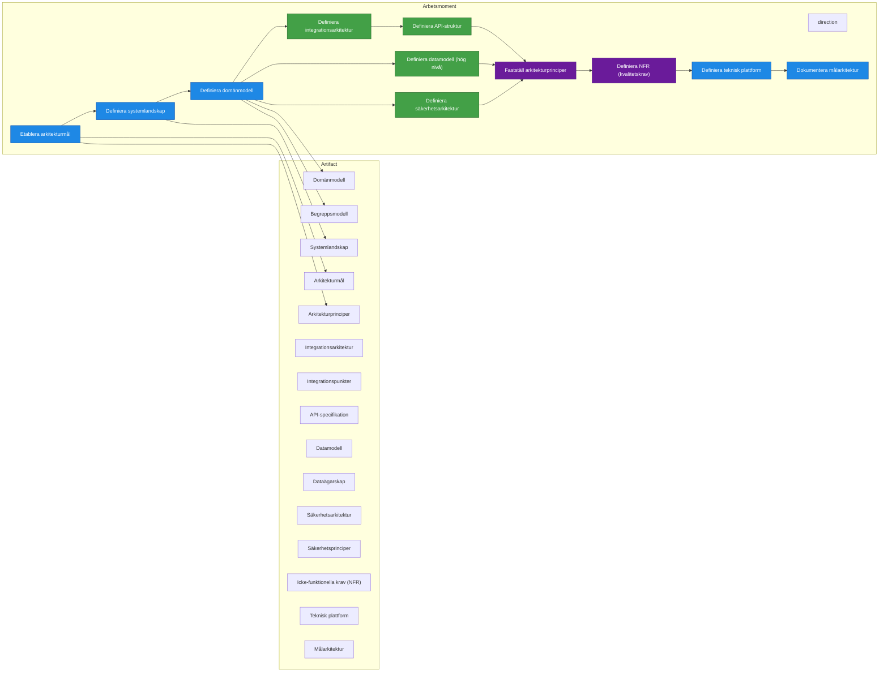
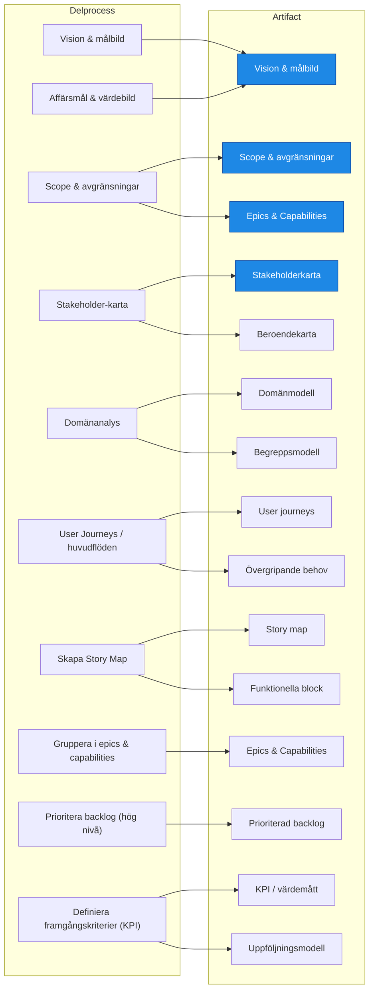

# Artifakter från processsteg

## Målarkitektur

Beskrivningar: `docs/artifacts/descriptions/2. Målarkitektur/` · Mallar: `docs/artifacts/templates/2. Målarkitektur/`

```mermaid
flowchart LR
    subgraph "Artifact"
        direction LR
        A1["Arkitekturmål"]
        A2["Arkitekturprinciper"]
        A3["Systemlandskap"]
        A4["Domänmodell"]
        A5["Begreppsmodell"]
        A6["Integrationsarkitektur"]
        A7["Integrationspunkter"]
        A8["API-specifikation"]
        A9["Datamodell"]
        A10["Dataägarskap"]
        A11["Säkerhetsarkitektur"]
        A12["Säkerhetsprinciper"]

        A13["Icke-funktionella krav (NFR)"]
        A14["Teknisk plattform"]
        A15["Målarkitektur"]
    end

    subgraph "Arbetsmoment"
        direction
        S1["Etablera arkitekturmål"] --> S2["Definiera systemlandskap"]
        S2 --> S3["Definiera domänmodell"]
        S3 --> B1["Definiera integrationsarkitektur"]
        S3 --> B2["Definiera datamodell (hög nivå)"]
        S3 --> B3["Definiera säkerhetsarkitektur"]
        B1 --> B1a["Definiera API-struktur"]
        B1a --> C1["Fastställ arkitekturprinciper"]
        B2 --> C1
        B3 --> C1
        C1 --> C2["Definiera NFR (kvalitetskrav)"]
        C2 --> D1["Definiera teknisk plattform"]
        D1 --> E1["Dokumentera målarkitektur"]
    end

    S1 --> A1
    S1 --> A2
    S2 --> A3
    S3 --> A4
    S3 --> A5

%% ===== Styling (valfritt) =====
classDef seq fill:#1e88e5,stroke:#0d47a1,color:#fff;
classDef par fill:#43a047,stroke:#1b5e20,color:#fff;
classDef converge fill:#6a1b9a,stroke:#4a148c,color:#fff;

class S1,S2,S3 seq;
class B1,B2,B3,B1a par;
class C1,C2 converge;
class D1,E1 seq;
```

## Kravställning

```mermaid
flowchart LR
    subgraph "Delprocess"
        D1["Vision & målbild"]
        D2["Affärsmål & värdebild"]
        D3["Scope & avgränsningar"]
        D4["Stakeholder-karta"]
        D5["Domänanalys"]
        D6["User Journeys / huvudflöden"]
        D7["Skapa Story Map"]
        D8["Gruppera i epics & capabilities"]
        D9["Prioritera backlog (hög nivå)"]
        D0["Definiera framgångskriterier (KPI)"]
    end

    subgraph "Artifact"
        A1["Vision & målbild"]
        A2["Scope & avgränsningar"]
        A3["Epics & Capabilities"]
        A4["Stakeholderkarta"]
        A5["Beroendekarta"]
        A6["Domänmodell"]
        A7["Begreppsmodell"]
        A8["User journeys"]
        A9["Övergripande behov"]
        A10["Story map"]
        A11["Funktionella block"]
        A12["Epics & Capabilities"]
        A13["Prioriterad backlog"]
        A14["KPI / värdemått"]
        A15["Uppföljningsmodell"]
    end


    D1 --> A1
    D2 --> A1
    D3 --> A2
    D3 --> A3
    D4 --> A4
    D4 --> A5
    D5 --> A6
    D5 --> A7
    D6 --> A8
    D6 --> A9
    D7 --> A10
    D7 --> A11
    D8 --> A12
    D9 --> A13
    D0 --> A14
    D0 --> A15


    %% STYLING
    classDef seq fill:#1e88e5,stroke:#0d47a1,color:#fff;
    classDef par fill:#43a047,stroke:#1b5e20,color:#fff;
    classDef slut fill:#6a1b9a,stroke:#4a148c,color:#fff;

    class A1,A2,A3,A4 seq;
    class B1,B2,B3 par;
    class C1,C2,C3 slut;
```

```mermaid
flowchart LR
    subgraph " "
        %% Riktning, struktur, begränsningar
        A1["Arkitekturmål"]
        A3["Systemlandskap"]
        A4["Domänmodell"]
        A6["Integrationsarkitektur"]
        A13["Icke-funktionella krav (NFR)"]

        %% Konsekvent, byggbar, begriplig
        A2["Arkitekturprinciper"]
        A5["Begreppsmodell"]
        A9["Datamodell"]
        A8["API-specifikation"]
        A14["Teknisk plattform"]

        %% Fördjupar, konkretiserar, dokumenterar helhet
        A7["Integrationspunkter"]
        A10["Dataägarskap"]
        A11["Säkerhetsarkitektur"]
        A12["Säkerhetsprinciper"]
        A15["Målarkitektur"]
    end


%% ===== Styling (valfritt) =====
classDef prio1 fill:#1e88e5,stroke:#0d47a1,color:#fff;
classDef prio2 fill:#43a047,stroke:#1b5e20,color:#fff;
classDef prio3 fill:#6a1b9a,stroke:#4a148c,color:#fff;

class A1,A3,A4,A6,A13 prio1;
class A2,A5,A9,A8,A14 prio2;
class A7,A10,A11,A12,A15 prio3;
```
