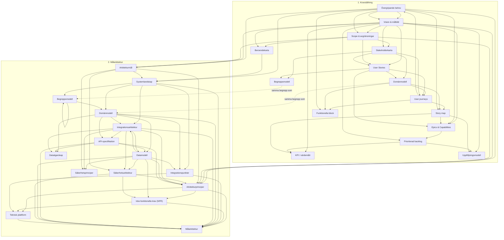

# Artefaktberoenden (Kravställning + Målarkitektur)

Diagrammet bygger på `## 3. Input` och `## 4. Output` i respektive SOP under `docs/SOP/`. Pil **A → B** betyder att artefakt **B** (output) i den aktuella SOP:en listar **A** som input.

**Obs:** I SOP `05_create_user_stories` anges *Affärsmål & värdebild* som input; SOP `02_affarsmal_och_vardebild` har i nuvarande text endast *Vision & målbild* som output. I diagrammet är det modellerat som att *Vision & målbild* täcker det behov som SOP 5 uttrycker (ev. dokumentationsglapp).

**Obs:** SOP `10_prioritera_backlog` nämner *Risker* som input utan motsvarande artefakt-output i andra SOP:er — den noden är utelämnad här.

## Cykler och “rundgång” (kärnan i problemet)

Följande beroenden bildar **cykler** i målarkitekturdelen (siffror = SOP-ordning i `2. Målarkitektur`):

1. **Domänmodell ↔ Begreppsmodell** — SOP 3 tar in *Begreppsmodell* och producerar både *Domänmodell* och uppdaterad *Begreppsmodell* (`Begreppsmodell` → `Begreppsmodell`).
2. **Domänmodell ↔ Integrationsarkitektur ↔ Datamodell ↔ API-specifikation** — SOP 4 kräver *Datamodell* innan *Integrationsarkitektur*; SOP 5–6 kräver *Integrationsarkitektur* / *API-specifikation* för *Datamodell*. Det är en **klassisk parallell design-loop** som i praktiken kräver iteration, grov nivå först eller avgränsad “spike”.

Pilarna ovan är **alla** explicita input→output från SOP:erna; cyklerna syns som att samma noder nås via olika vägar fram och tillbaka.
