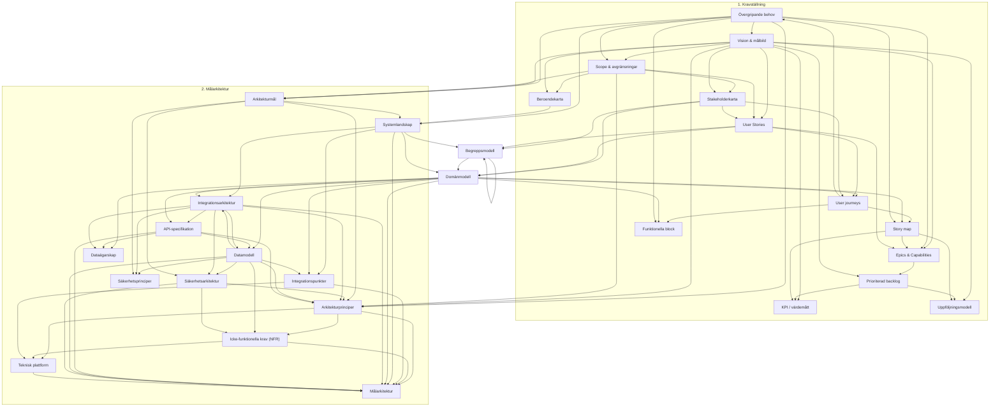

# Artefaktberoenden (Kravställning + Målarkitektur)

Diagrammet bygger på `## 3. Input` och `## 4. Output` i respektive SOP under `docs/SOP/`. Pil **A → B** betyder att artefakt **B** (output) i den aktuella SOP:en listar **A** som input.

**Obs:** I SOP `05_create_user_stories` anges *Affärsmål & värdebild* som input; SOP `02_affarsmal_och_vardebild` har i nuvarande text endast *Vision & målbild* som output. I diagrammet antas att *Vision & målbild* täcker det behov som SOP 5 uttrycker (ev. dokumentationsglapp).

**Obs:** SOP `10_prioritera_backlog` nämner *Risker* som input utan motsvarande artefakt-output i andra SOP:er — den noden är utelämnad här.

**Domänmodell** och **Begreppsmodell** är **en nod vardera** (samma artefakt förekommer i både Kravställning och Målarkitektur).

## Cykler och “rundgång”

| Cykel | Förklaring |
|--------|------------|
| **BM → BM** | SOP *Definiera domänmodell* (målarkitektur) listar *Begreppsmodell* som både input och output — iteration av samma artefakt. |
| **DM ↔ BM ↔ SL** | *Systemlandskap* matar *Domänmodell* / *Begreppsmodell*; *Domänmodell* och *Begreppsmodell* återkopplar till varandra via samma SOP. |
| **DM → IA → API → DD → IA** (och varianter) | SOP *Integrationsarkitektur* kräver *Datamodell*; *API-struktur* kräver *Integrationsarkitektur* och *Domänmodell*; *Datamodell* kräver *API-specifikation* och *Integrationsarkitektur*. Det är en **större cykel** mellan integration, API och data som kräver grov→fin iteration eller parallellt arbete med temporära antaganden. |
| **AP → … → AP** | *Arkitekturprinciper* produceras tidigt (SOP 1) och **fastställs** igen i SOP 8 med input från bl.a. *Säkerhetsarkitektur*, *Datamodell*, *API-specifikation* — samma artefaktnamn, två “varv”. |
| **MZ → (indirekt)** | *Målarkitektur* (slutartefakt) sammanför alla tidigare; *Teknisk plattform* (SOP 10) producerar också *Målarkitektur* som output — överlapp/två varv mot samma slutdokument. |

Kravställning har dessutom **UJ → OB** (*User journeys* producerar *Övergripande behov*), vilket skapar återkoppling till tidigare kravsteg (behov fördjupas efter journeys).
