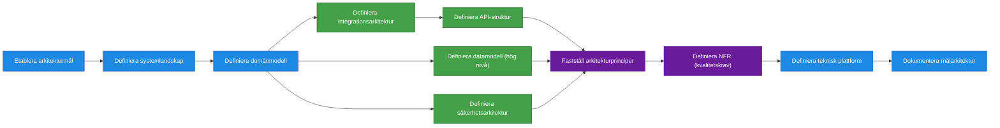

# Processsteg: Målarkitektur / Lösningsarkitektur

## Syfte

Definiera **hur den färdiga lösningen ska se ut när hela produkten är implementerad**.
Målarkitekturen skapar en gemensam teknisk och strukturell målbild som styr utvecklingen och säkerställer att lösningen blir:

- skalbar
- säker
- hållbar över tid
- möjlig att vidareutveckla

Fasen säkerställer att funktionella krav kan realiseras i en sammanhängande teknisk lösning och att alla viktiga tekniska beslut fattas innan större implementation påbörjas.

Resultatet är en **målarkitektur som beskriver system, komponenter, integrationer och tekniska principer för den färdiga produkten**.

---

# Delprocesser och aktiviteter

## Delprocess 1: Etablera arkitekturmål

Fastställer de övergripande mål som styr arkitekturens utformning.
Här ingår att analysera krav, formulera tekniska mål och identifiera vägledande designprinciper.

➡ **Se ../SOP/Målarkitektur/01_etablera_arkitekturmal.md.**

---

## Delprocess 2: Definiera systemlandskap

Skapar en helhetsbild av alla system och komponenter som påverkas eller ingår i lösningen.
Visar bland annat huvudsystem, externa beroenden, integrationer och gränssnitt.

➡ **Se ../SOP/Målarkitektur/02_definiera_systemlandskap.md.**

---

## Delprocess 3: Definiera domänmodell

En modell över centrala begrepp och objekt som systemet hanterar.
Inkluderar relationer och begreppsdefinitioner.

➡ **Se ../SOP/Målarkitektur/03_definiera_domanmodell.md.**

---

## Delprocess 4: Definiera integrationsarkitektur

Beskriver hur lösningen integrerar med andra system.
Innehåller integrationspunkter, mönster, datautbyte och ansvarsfördelning.

➡ **Se ../SOP/Målarkitektur/04_definiera_integrationsarkitektur.md.**

---

## Delprocess 5: Definiera API‑struktur

Beskriver API‑er och kontrakt som används mellan system.
Inkluderar API‑standarder, kontrakt och dataformat på hög nivå.

➡ **Se ../SOP/Målarkitektur/05_definiera_api_struktur.md.**

---

## Delprocess 6: Definiera datamodell (hög nivå)

En övergripande modell över hur information struktureras och flödar i lösningen.
Inkluderar datatyper, relationer, lagringsprinciper, dataägarskap och dataskydd.

➡ **Se ../SOP/Målarkitektur/06_definiera_datamodell.md.**

---

## Delprocess 7: Definiera säkerhetsarkitektur

Definierar hur lösningen skyddar information, användare och system.
Innehåller autentisering, auktorisation, dataskydd och säkerhetsprinciper.

➡ **Se ../SOP/Målarkitektur/07_definiera_sakerhetsarkitektur.md.**

---

## Delprocess 8: Fastställ arkitekturprinciper

Samlar och fastställer de vägledande principer som ska styra design och utveckling av lösningen.
Exempel: löst kopplade komponenter, API‑driven integration, säkerhet som standard.

➡ **Se ../SOP/Målarkitektur/08_faststall_arkitekturprinciper.md.**

---

## Delprocess 9: Definiera Non‑Functional Requirements (NFR)

Definierar de tekniska kvalitetskrav som lösningen måste uppfylla.
Inkluderar prestanda, tillgänglighet, säkerhet, driftbarhet, loggning och övervakning.

➡ **Se ../SOP/Målarkitektur/09_definiera_nfr.md.**

---

## Delprocess 10: Definiera teknisk plattform

Fastställer tekniska plattformar för utveckling, drift och deployment.
Innehåller miljöprinciper, teknikval och CI/CD‑ramverk.

➡ **Se ../SOP/Målarkitektur/10_definiera_teknisk_plattform.md.**

---

## Delprocess 11: Dokumentera målarkitektur

Sammanställer hela arkitekturen till en sammanhängande målbild.
Dokumenterar systemlandskap, principer, modeller samt vägledande beslut.

➡ **Se ../SOP/Målarkitektur/11_dokumentera_malarkitektur.md.**

---

# Resultat från fasen

När fasen är klar ska följande finnas:

- definierat systemlandskap
- tydlig domänmodell
- integrationsarkitektur
- datamodell på hög nivå
- API‑struktur
- säkerhetsarkitektur
- teknisk plattform
- definierade Non‑Functional Requirements
- dokumenterad målarkitektur

Detta utgör grunden för nästa fas: **Leveransstrategi och Roadmap**.
