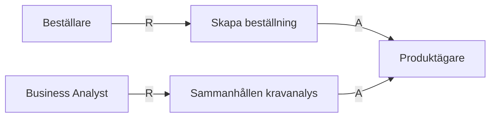
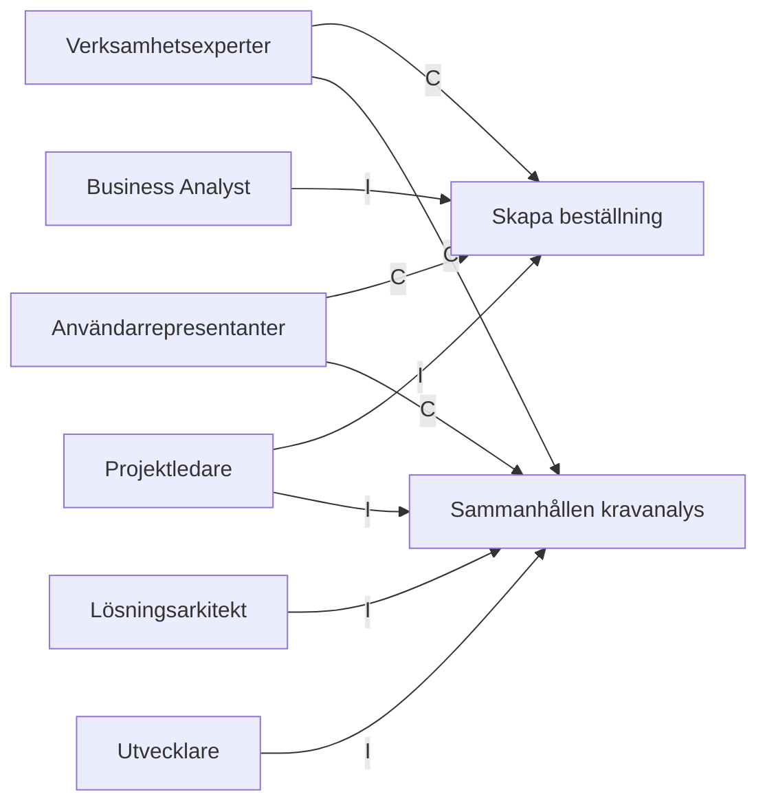

# Roller nödvändiga för Kravställning / Problemdefinition

## RACI tabell

| Artifact | R | A | C | I |
| --- | --- | --- | --- | --- |
| [Beställning](../artifacts/descriptions/1.Kravställning/beställning.md) | Beställare | Produktägare | Verksamhetsexperter, Användarrepresentanter | Business Analyst, Projektledare |
| [Vision & målbild](../artifacts/descriptions/1.Kravställning/vision_malbild.md) | Business Analyst | Produktägare | Verksamhetsexperter, Användarrepresentanter | Lösningsarkitekt, Utvecklare, Projektledare |
| [Omfattning och Strukturerad Backlog](../artifacts/descriptions/1.Kravställning/Omfattning_Strukturerad_Backlog.md) | Business Analyst | Produktägare | Verksamhetsexperter, Användarrepresentanter | Lösningsarkitekt, Utvecklare, Projektledare |
| [Stakeholderkarta](../artifacts/descriptions/1.Kravställning/Stakeholderkarta.md) | Business Analyst | Produktägare | Verksamhetsexperter, Användarrepresentanter | Lösningsarkitekt, Utvecklare, Projektledare |
| [KPI / värdemått](../artifacts/descriptions/1.Kravställning/kpi_vardematt.md) | Business Analyst | Produktägare | Verksamhetsexperter, Användarrepresentanter | Lösningsarkitekt, Utvecklare, Projektledare |

## RA-diagram: Vem utför och vem godkänner

## CI-diagram: Vilka stöttar i och vilka informeras

