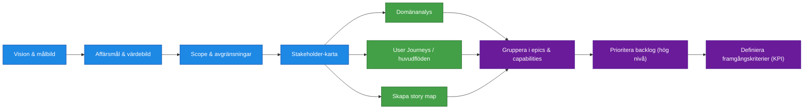

| Artifact                                                                                      | R                | A            | C                 | I                |
| --------------------------------------------------------------------------------------------- | ---------------- | ------------ | ----------------- | ---------------- |
| [Beställning](../artifacts/descriptions/1.Kravställning/beställning.md)                       | Beställare       | Beställare | Verksamhetsexperter | Business Analyst |
| [Vision & målbild](../artifacts/descriptions/1.Kravställning/Vision%20&%20målbild.md)         | Business Analyst | Beställare | Verksamhetsexperter | Projektledare    |
| [Scope & avgränsningar](../artifacts/descriptions/1.Kravställning/scope_och_avgränsningar.md) | Business Analyst | Beställare | Verksamhetsexperter | Projektledare    |
| [Stakeholderkarta](../artifacts/descriptions/1.Kravställning/Stakeholderkarta.md)             | Business Analyst | Beställare | Verksamhetsexperter | Utvecklare       |
| [Strukturerad backlog](../artifacts/descriptions/1.Kravställning/Prioriterad%20backlog.md)    | Business Analyst | Beställare | Verksamhetsexperter | Utvecklare       |
| [KPI / värdemått](../artifacts/descriptions/1.Kravställning/KPI%20_%20värdemått.md)           | Business Analyst | Beställare | Verksamhetsexperter | Projektledare    |

Processuppdatering
Process Beställare -> BA skapar allt -> Best granskar -> BA uppdaterar -> Until done
[X] Beställare ersätts av beställare, beställare är manuell person
1. Breställare skickar in vision och målbild
2. Business Analyst skapar upp dokument
3. Beställare granskar och godkänner / avslår
4. BA uppdaterar baserat på feedback

