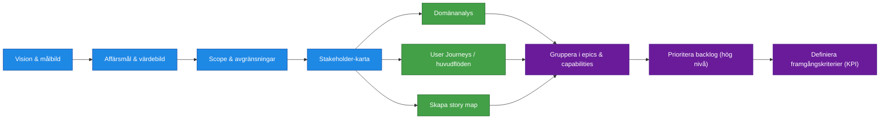

| Artifact                                                                                      | R                | A            | C                 | I                |
| --------------------------------------------------------------------------------------------- | ---------------- | ------------ | ----------------- | ---------------- |
| [Beställning](../artifacts/descriptions/1.Kravställning/beställning.md)                       | Beställare       | Produktägare | Verksamhetsexperter | Business Analyst |
| [Vision & målbild](../artifacts/descriptions/1.Kravställning/Vision%20&%20målbild.md)         | Business Analyst | Produktägare | Verksamhetsexperter | Projektledare    |
| [Scope & avgränsningar](../artifacts/descriptions/1.Kravställning/scope_och_avgränsningar.md) | Business Analyst | Produktägare | Verksamhetsexperter | Projektledare    |
| [Stakeholderkarta](../artifacts/descriptions/1.Kravställning/Stakeholderkarta.md)             | Business Analyst | Produktägare | Verksamhetsexperter | Utvecklare       |
| [Strukturerad backlog](../artifacts/descriptions/1.Kravställning/Prioriterad%20backlog.md)    | Business Analyst | Produktägare | Verksamhetsexperter | Utvecklare       |
| [KPI / värdemått](../artifacts/descriptions/1.Kravställning/KPI%20_%20värdemått.md)           | Business Analyst | Produktägare | Verksamhetsexperter | Projektledare    |

## Processuppdatering

Detta framework använder en balanserad ansvarsfördelning i kravställningen:

1. Beställare initierar behov och bidrar med mål, kontext och verksamhetsvärde.
2. Business Analyst tar fram och konsoliderar kravartefakter.
3. Produktägare granskar, godkänner eller avslår artefakter som accountable-roll.
4. Business Analyst uppdaterar artefakter utifrån feedback tills de är tillräckligt bra.

