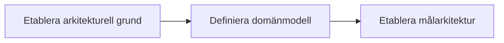
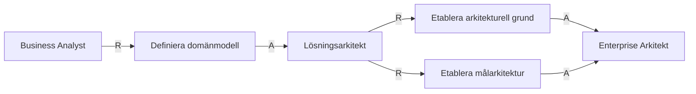
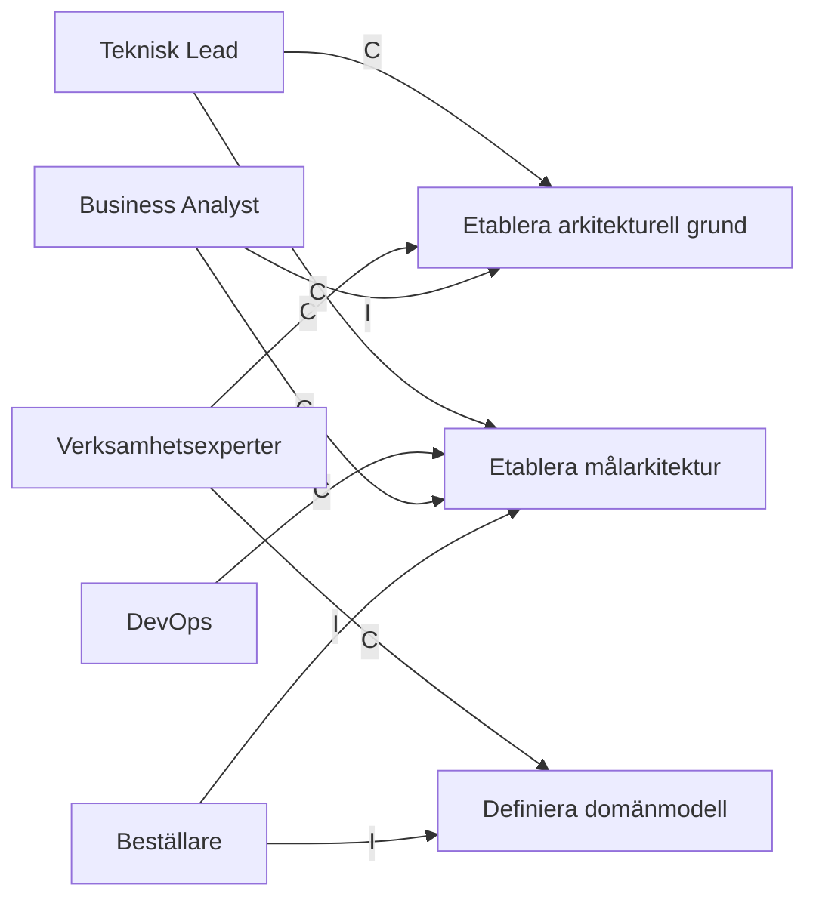

# Roller nödvändiga för Målarkitektur

## RACI tabell

| Artefakt / Resultat | R | A | C | I |
| --- | --- | --- | --- | --- |
| [Arkitekturmål](../artifacts/descriptions/2.%20Målarkitektur/Arkitekturmål.md) | Lösningsarkitekt | Enterprise Arkitekt | Teknisk Lead, Verksamhetsexperter | Business Analyst |
| [Systemlandskap](../artifacts/descriptions/2.%20Målarkitektur/Systemlandskap.md) | Lösningsarkitekt | Enterprise Arkitekt | Teknisk Lead, Verksamhetsexperter | Business Analyst |
| [Domänmodell](../artifacts/descriptions/2.%20Målarkitektur/Domänmodell.md) | Business Analyst | Lösningsarkitekt | Verksamhetsexperter | Beställare |
| [Integrationsarkitektur](../artifacts/descriptions/2.%20Målarkitektur/Integrationsarkitektur.md) | Lösningsarkitekt | Enterprise Arkitekt | Teknisk Lead, DevOps, Business Analyst | Beställare |
| [Arkitekturprinciper](../artifacts/descriptions/2.%20Målarkitektur/Arkitekturprinciper.md) | Lösningsarkitekt | Enterprise Arkitekt | Teknisk Lead, DevOps, Business Analyst | Beställare |
| [Icke-funktionella krav](../artifacts/descriptions/2.%20Målarkitektur/Icke-funktionella%20krav.md) | Lösningsarkitekt | Enterprise Arkitekt | Teknisk Lead, DevOps, Business Analyst | Beställare |
| [Målarkitektur](../artifacts/descriptions/2.%20Målarkitektur/Målarkitektur.md) | Lösningsarkitekt | Enterprise Arkitekt | Teknisk Lead, DevOps, Business Analyst | Beställare |

## RA-diagram: Vem utför och vem godkänner

## CI-diagram: Vilka stöttar i och vilka informeras

