# Roller nödvändiga för att ta fram Roadmap och Leveransstrategi

```mermaid
flowchart LR
    %% SEKVENTIELL HUVUDFLÖDE
    A1["Skapa MVP"] --> A2["Strukturera story map till leveranspaket"]
    A2 --> A3["Identifiera tekniska beroenden"]
    A3 --> A4["Prioritera funktionalitet"]
    A4 --> A5["Skapa releaseplan"]
    A5 --> A6["Skapa produktroadmap"]

    %% VISUELL PARALLELLITET
    %% Prioritering kan påbörjas innan beroenden är KLARA, men inte avslutas.
    A3 -. delvis parallellt .-> A4

    %% STYLING
    classDef seq fill:#1e88e5,stroke:#0d47a1,color:#fff;
    classDef par fill:#43a047,stroke:#1b5e20,color:#fff;

    class A1,A2,A3,A4,A5,A6 seq;
```

| Artifact                                                                               | R                | A                | C                | I                   |
| -------------------------------------------------------------------------------------- | ---------------- | ---------------- | ---------------- | ------------------- |
| [MVP-definition](../artifacts/descriptions/3.%20Roadmap/MVP-definition.md)             | Business Analyst | Beställare     | Lösningsarkitekt | Utvecklare          |
| [Releasepaket](../artifacts/descriptions/3.%20Roadmap/Releasepaket.md)                 | Business Analyst | Beställare     | Lösningsarkitekt | Utvecklare          |
| [Releaseplan](../artifacts/descriptions/3.%20Roadmap/Releaseplan.md)                   | Business Analyst | Beställare     | Lösningsarkitekt | Utvecklare          |
| [Roadmap](../artifacts/descriptions/3.%20Roadmap/Roadmap.md)                           | Business Analyst | Beställare     | Lösningsarkitekt | Verksamhetsexperter |
| [Prioriterad backlog](../artifacts/descriptions/3.%20Roadmap/Prioriterad%20backlog.md) | Business Analyst | Beställare     | Lösningsarkitekt | Utvecklare          |
| [Beroendekarta](../artifacts/descriptions/3.%20Roadmap/Beroendekarta.md)               | Teknisk Lead     | Lösningsarkitekt | Utvecklare       | Beställare        |
| [Sekvensplan](../artifacts/descriptions/3.%20Roadmap/Sekvensplan.md)                   | Teknisk Lead     | Lösningsarkitekt | Utvecklare       | Beställare        |
