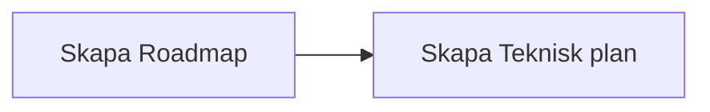
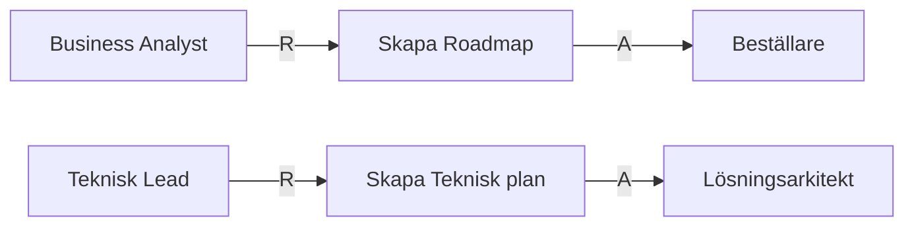
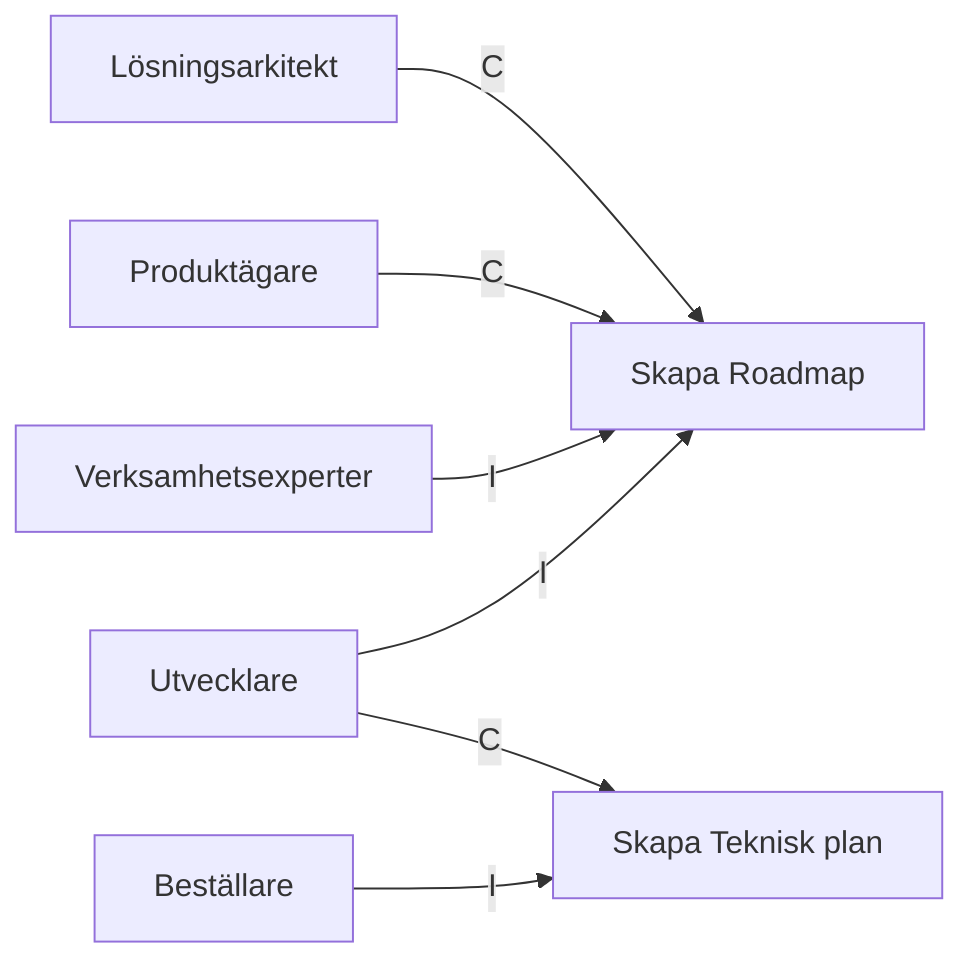

# Roller nödvändiga för att ta fram Roadmap och Leveransstrategi

## RACI tabell

| Artifact | R | A | C | I |
| --- | --- | --- | --- | --- |
| [Roadmap](../artifacts/descriptions/3.%20Roadmap/Roadmap.md) | Business Analyst | Beställare | Lösningsarkitekt, Produktägare | Verksamhetsexperter, Utvecklare |
| [Teknisk plan](../artifacts/descriptions/3.%20Roadmap/teknisk_plan.md) | Teknisk Lead | Lösningsarkitekt | Utvecklare | Beställare |

## RA-diagram: Vem utför och vem godkänner

## CI-diagram: Vilka stöttar i och vilka informeras

