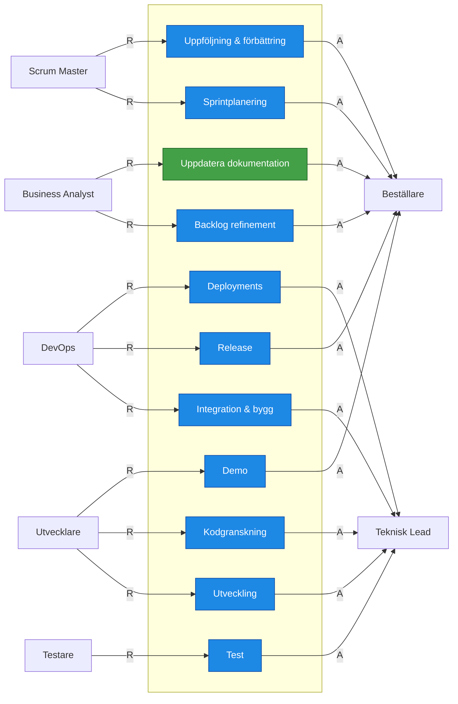
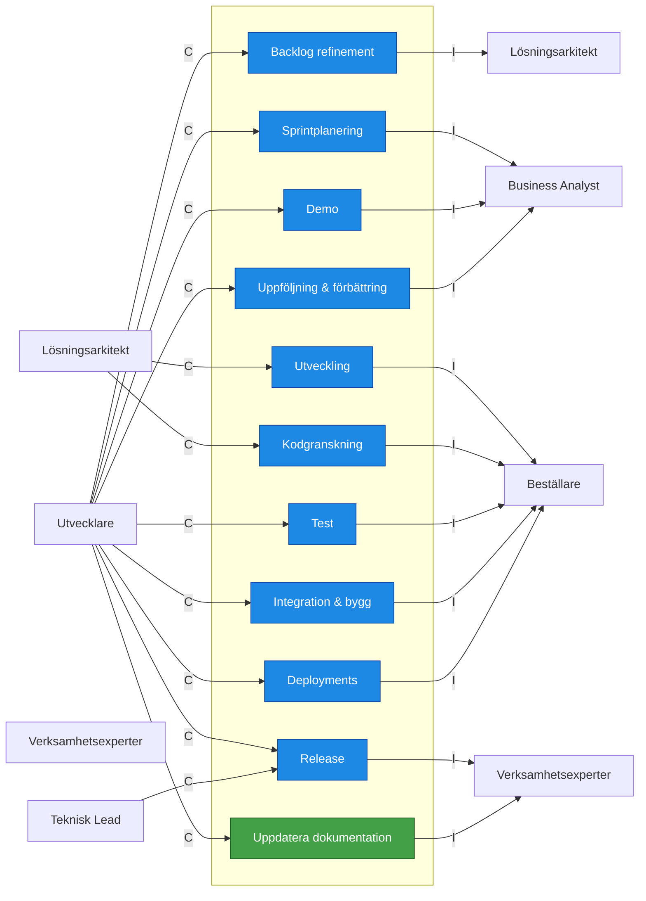

# Roller nödvändiga för Leverans / Implementation

```mermaid
flowchart LR

    %% ===== SEKVENTIELL START: PLANERING =====
    A1["Delprocess 1: Backlog refinement"] --> A2["Delprocess 2: Sprintplanering"]
    A2 --> B1["Delprocess 3: Utveckling"]
    B1 --> B2["Delprocess 4: Kodgranskning"]

    %% ===== TESTNING ÄR SEKVENTIELLT EFTER KOD =====
    B2 --> B3["Delprocess 5: Test"]

    %% ===== CI/CD-KEDJA =====
    B3 --> C1["Delprocess 6: Integration & bygg"]

    %% ===== DEMO =====
    C1 --> D1["Delprocess 7: Demo"]

    %% ===== RELEASE =====
    D1 --> E1["Delprocess 8: Release"]

    %% ===== DEPLOYMENT =====
    E1 --> F1["Delprocess 9: Deployments"]

    %% ===== DOKUMENTATION (KAN KÖRAS PARALLELLT EFTER RELEASE) =====
    E1 -. parallellt .-> E2["Delprocess 10: Uppdatera dokumentation"]
    F1 -. parallellt .-> E2

    %% ===== RETROSPEKTIV / FÖRBÄTTRING =====
    E2 --> G1["Delprocess 11: Uppföljning & förbättring"]
    F1 --> G1

    %% ===== SLUT: SIGNAL FRAMÅT TILL REPEAT =====
    G1 --> H1["Input till nästa processsteg (Repeat)"]

    %% ===== STYLING =====
    classDef seq fill:#1e88e5,stroke:#0d47a1,color:#fff;
    classDef par fill:#43a047,stroke:#1b5e20,color:#fff;
    classDef converge fill:#6a1b9a,stroke:#4a148c,color:#fff;

    class A1,A2,B1,B2,B3,C1,D1,E1,F1,G1,H1 seq;
    class E2 par;
```

## RACI tabell

| Artifact                  | R                 | A            | C                   | I                   |
| ------------------------- | ----------------- | ------------ | ------------------- | ------------------- |
| User Stories              | Business Analyst  | Beställare | Utvecklare          | Lösningsarkitekt    |
| Ready backlog             | Business Analyst  | Beställare | Utvecklare          | Lösningsarkitekt    |
| Sprintmål                 | Scrum Master      | Beställare | Utvecklare          | Business Analyst    |
| Sprint backlog            | Scrum Master      | Beställare | Utvecklare          | Business Analyst    |
| Produktinkrement          | Utvecklare,DevOps | Teknisk Lead | Lösningsarkitekt    | Beställare        |
| Kod för granskning        | Utvecklare        | Teknisk Lead | Lösningsarkitekt    | Beställare        |
| Verifierad funktionalitet | Utvecklare        | Teknisk Lead | Lösningsarkitekt    | Beställare        |
| Kodförbättringar          | Utvecklare        | Teknisk Lead | Lösningsarkitekt    | Beställare        |
| Testresultat              | Testare           | Teknisk Lead | Utvecklare          | Beställare        |
| Verifierad funktionalitet | Testare           | Teknisk Lead | Utvecklare          | Beställare        |
| Byggt system              | DevOps            | Teknisk Lead | Utvecklare          | Beställare        |
| Demo-underlag             | DevOps            | Teknisk Lead | Utvecklare          | Beställare        |
| Feedback                  | Utvecklare        | Beställare | Verksamhetsexperter | Business Analyst    |
| Verifierad funktionalitet | Utvecklare        | Beställare | Verksamhetsexperter | Business Analyst    |
| Releasepaket              | DevOps            | Beställare | Utvecklare          | Verksamhetsexperter |
| Release notes             | DevOps            | Beställare | Utvecklare          | Verksamhetsexperter |
| Deployment                | DevOps            | Teknisk Lead | Utvecklare          | Beställare        |
| Dokumentation             | Business Analyst  | Beställare | Utvecklare          | Verksamhetsexperter |
| Förbättringsförslag       | Scrum Master      | Beställare | Utvecklare          | Business Analyst    |
| Retrospektiv              | Scrum Master      | Beställare | Utvecklare          | Business Analyst    |

## RA-Diagram: Vem utför och vem godkänner

## CI-Diagram: Vilka stöttar i och vilka informeras

