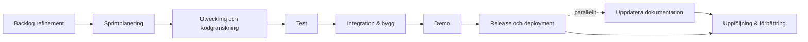
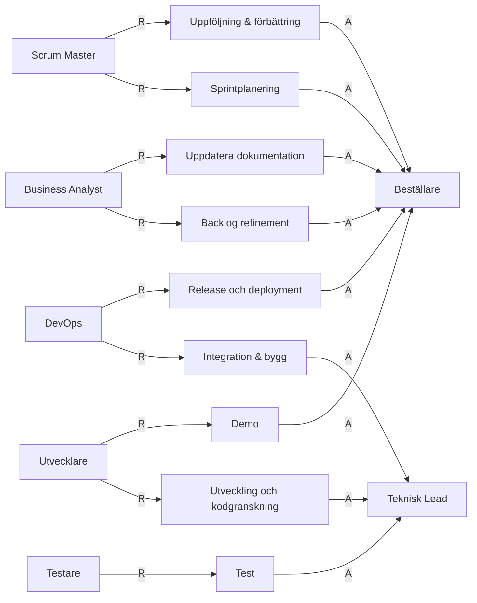
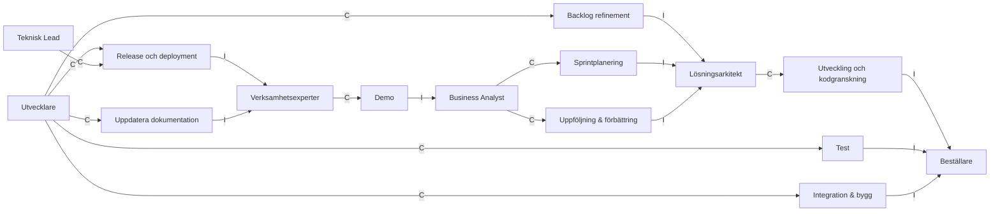

# Roller nödvändiga för Leverans / Implementation

## RACI tabell

| Artifact | R | A | C | I |
| --- | --- | --- | --- | --- |
| [Sprint backlog](../artifacts/descriptions/4.%20Leverans/sprint_backlog.md) | Scrum Master | Beställare | Business Analyst, Utvecklare | Lösningsarkitekt |
| [Produktinkrement](../artifacts/descriptions/4.%20Leverans/produktinkrement.md) | Utvecklare, DevOps | Teknisk Lead | Lösningsarkitekt | Beställare |
| [Testresultat](../artifacts/descriptions/4.%20Leverans/testresultat.md) | Testare | Teknisk Lead | Utvecklare | Beställare |
| [Releasepaket](../artifacts/descriptions/4.%20Leverans/releasepaket.md) | DevOps | Beställare | Utvecklare, Teknisk Lead | Verksamhetsexperter |
| [Dokumentation](../artifacts/descriptions/4.%20Leverans/dokumentation.md) | Business Analyst | Beställare | Utvecklare | Verksamhetsexperter |
| [Förbättringsförslag](../artifacts/descriptions/4.%20Leverans/forbattringsforslag.md) | Scrum Master | Beställare | Utvecklare, Business Analyst | Lösningsarkitekt |

## RA-diagram: Vem utför och vem godkänner

## CI-diagram: Vilka stöttar i och vilka informeras

