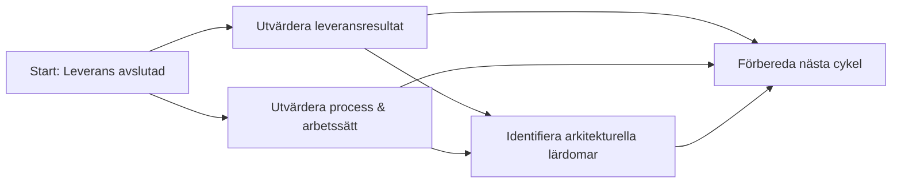
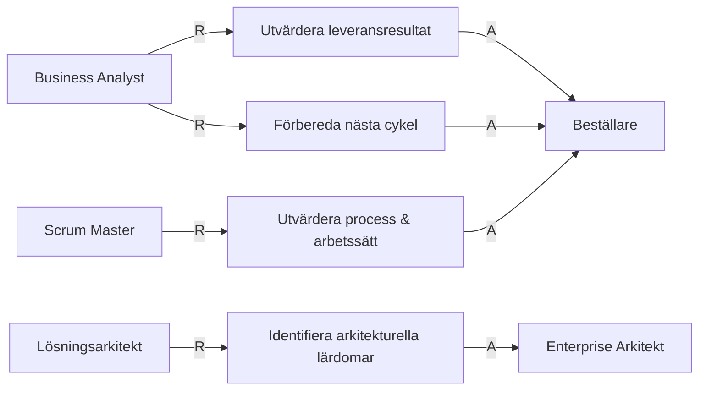
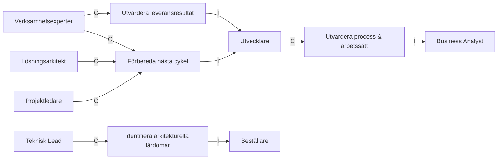

# Roller nödvändiga för Repeat / Reflektion & Justering

## RACI tabell

| Artifact | R | A | C | I |
| --- | --- | --- | --- | --- |
| [Leveransutvärdering](../artifacts/descriptions/5.%20Repeat/leveransutvardering.md) | Business Analyst | Beställare | Verksamhetsexperter | Utvecklare |
| [Processförbättringar](../artifacts/descriptions/5.%20Repeat/processforbattringar.md) | Scrum Master | Beställare | Utvecklare, Business Analyst | Lösningsarkitekt |
| [Arkitekturinsikter](../artifacts/descriptions/5.%20Repeat/arkitekturinsikter.md) | Lösningsarkitekt | Enterprise Arkitekt | Teknisk Lead | Beställare |
| [Cykelstart-brief](../artifacts/descriptions/5.%20Repeat/cykelstart-brief.md) | Business Analyst | Beställare | Lösningsarkitekt, Verksamhetsexperter | Utvecklare |

## RA-diagram: Vem utför och vem godkänner

## CI-diagram: Vilka stöttar i och vilka informeras

