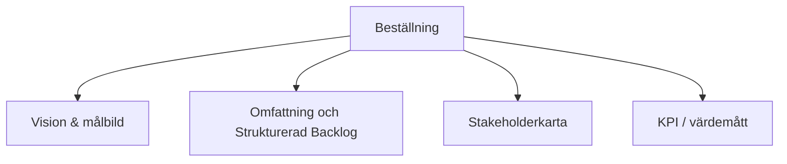
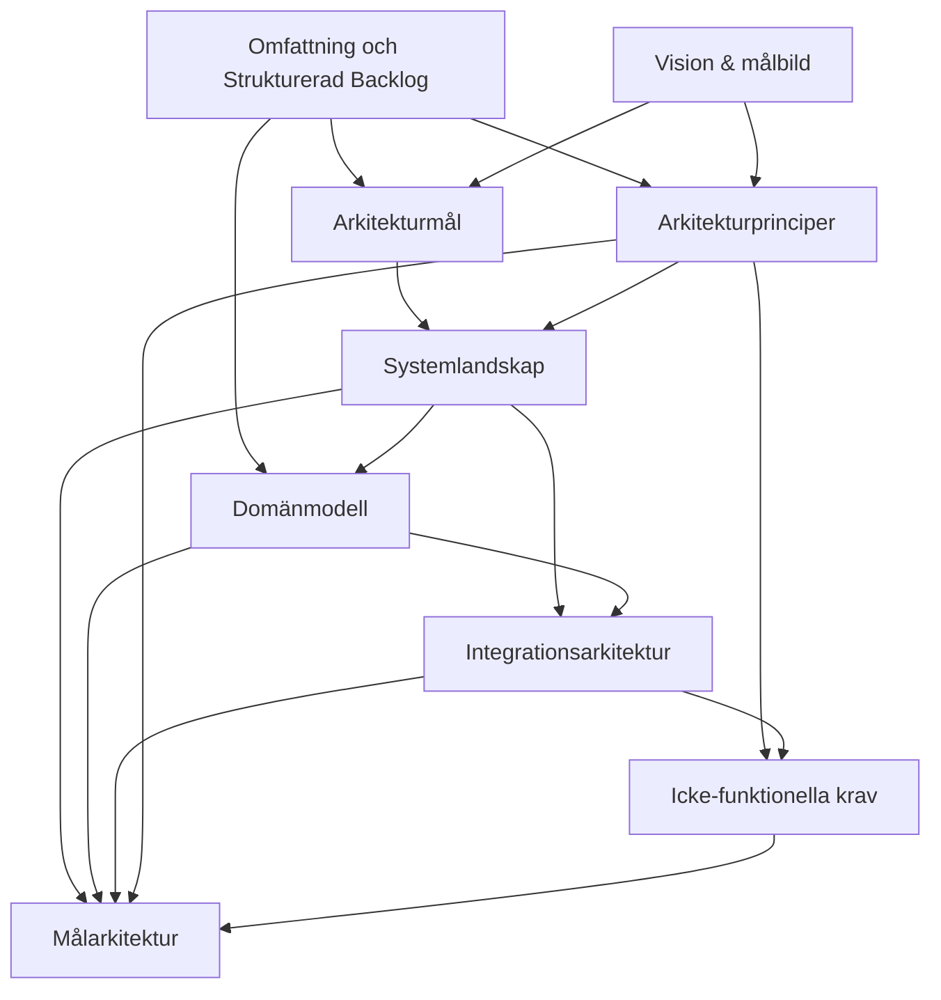
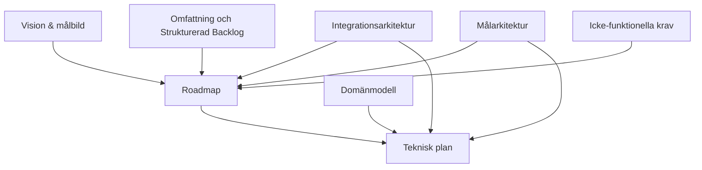
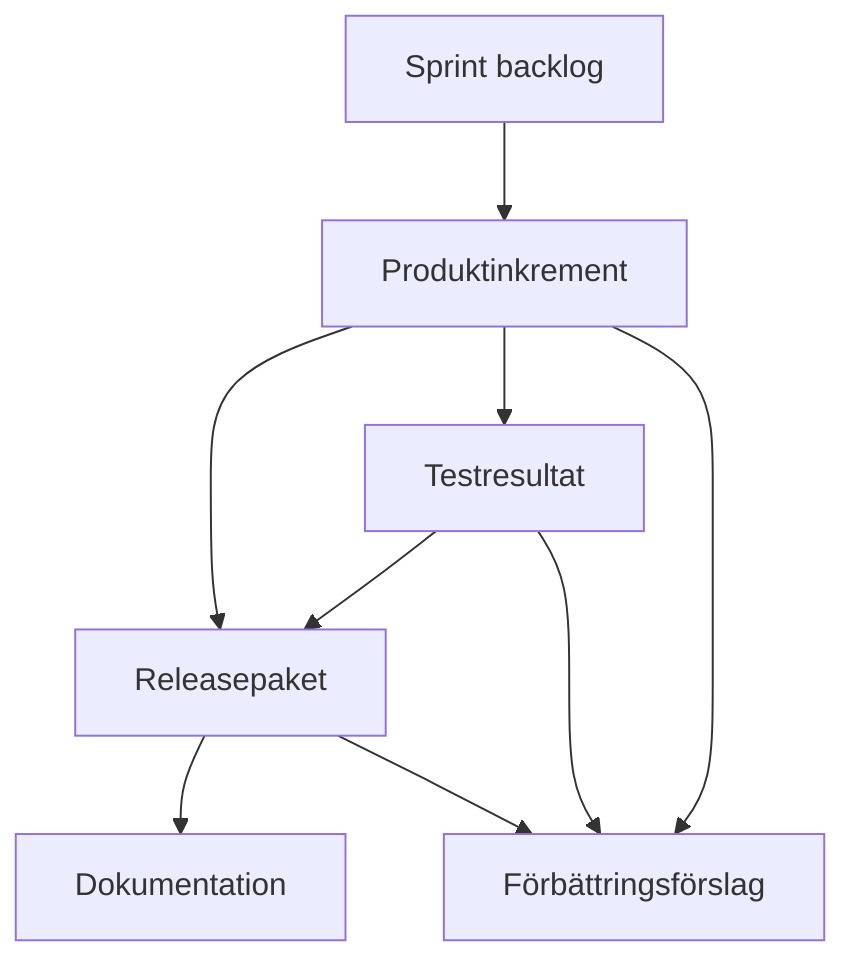
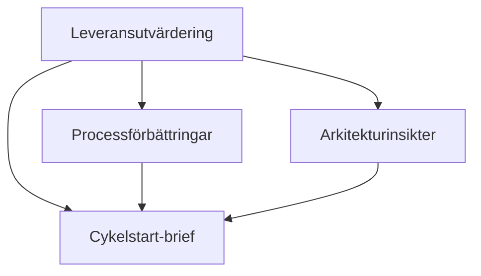

# Artefaktberoenden

Skapande av artifakter sker i en bestämd ordning. Beroenden framgår av bilder i diagrammen nedan.

## Kravställning

```mermaid
flowchart
B["Beställning"]
VM["Vision & målbild"]
OSB["Omfattning och Strukturerad Backlog"]
SK["Stakeholderkarta"]
KPI["KPI / värdemått"]

B --> VM
B --> OSB
B --> SK
B --> KPI
```

## Målarkitektur

```mermaid
flowchart
OSB["Omfattning och Strukturerad Backlog"]
VM["Vision & målbild"]
AM["Arkitekturmål"]
AP["Arkitekturprinciper"]
SL["Systemlandskap"]
DM["Domänmodell"]
IA["Integrationsarkitektur"]
NFR["Icke-funktionella krav"]
MZ["Målarkitektur"]

OSB --> AM
VM --> AM
OSB --> AP
VM --> AP
AM --> SL
AP --> SL
OSB --> DM
SL --> DM
SL --> IA
DM --> IA
AP --> NFR
IA --> NFR
SL --> MZ
DM --> MZ
IA --> MZ
AP --> MZ
NFR --> MZ
```

## Roadmap

```mermaid
flowchart
RM["Roadmap"]
TP["Teknisk plan"]
VM["Vision & målbild"]
OSB["Omfattning och Strukturerad Backlog"]
DM["Domänmodell"]
IA["Integrationsarkitektur"]
MA["Målarkitektur"]
NFR["Icke-funktionella krav"]

VM --> RM
OSB --> RM
MA --> RM
IA --> RM
NFR --> RM
RM --> TP
DM --> TP
IA --> TP
MA --> TP
```

## Leverans

```mermaid
flowchart
  SB["Sprint backlog"]
  PI["Produktinkrement"]
  TR["Testresultat"]
  RP["Releasepaket"]
  DO["Dokumentation"]
  FB["Förbättringsförslag"]

  SB --> PI
  PI --> TR
  PI --> RP
  TR --> RP
  RP --> DO
  RP --> FB
  TR --> FB
  PI --> FB
```

## Repeat

```mermaid
flowchart
  LU["Leveransutvärdering"]
  PF["Processförbättringar"]
  AI["Arkitekturinsikter"]
  CB["Cykelstart-brief"]

  LU --> PF
  LU --> AI
  LU --> CB
  PF --> CB
  AI --> CB
```
