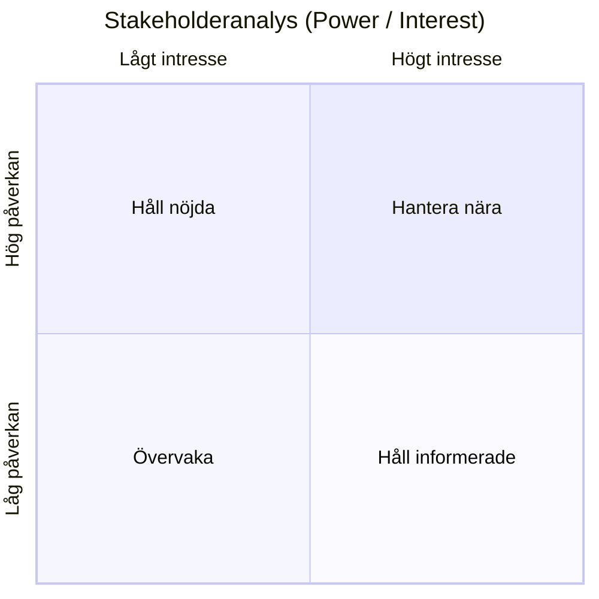

# Stakeholderkarta

## Metadata
| Fält | Värde |
|------|------|
| Artifakttyp | Krav |
| Ägare | Business Analyst |
| Version | 1.0 |
| Datum | |
| Status | |

---

## 1. Översikt
| Fält | Innehåll |
|------|----------|
| Syfte | |
| Referenser | |
| Sammanfattning | |

---

## 2. Identifierade intressenter
| Intressent | Typ | Roll | Påverkan (H/M/L) | Intresse (H/M/L) |
|------------|-----|------|------------------|------------------|
| | | | | |
| | | | | |

---

## 3. Visualisering (Power/Interest)

---

## 4. Behov & förväntningar
| Intressent | Behov | Förväntningar | Risk vid ej uppfyllt |
|------------|-------|----------------|----------------------|
| | | | |
| | | | |

---

## 5. Engagemangsstrategi
| Intressent | Strategi | Kommunikationssätt | Frekvens |
|------------|----------|--------------------|----------|
| | | | |
| | | | |

---

## 6. Kritiska intressenter
| Intressent | Varför kritisk | Åtgärd |
|------------|----------------|--------|
| | | |
| | | |

---

## 7. Antaganden
- 
- 

---

## 8. Risker kopplade till intressenter
| Risk | Påverkan | Åtgärd |
|------|----------|--------|
| | | |
| | | |

---

## 9. Koppling till vidare arbete
Denna artefakt används som input till:

- Kravställning
- Prioritering
- UX / Design
- Roadmap

---

## 10. Godkännande
| Roll | Namn | Datum |
|------|------|--------|
| Beställare | | |
| Business Analyst | | |
| Övriga | | |
