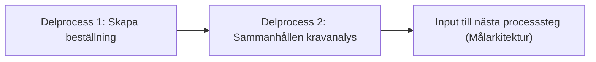

# Processsteg: Kravställning / Problemdefinition

## Syfte

Syftet med denna fas är att skapa en gemensam och strukturerad förståelse för vilket problem som ska lösas och vilket värde lösningen ska skapa.
Fasen säkerställer att organisationen bygger **rätt produkt** genom att tydliggöra målbild, behov, omfattning och användarflöden innan tekniska lösningar tas fram.

Resultatet av fasen ska vara en **strukturerad och prioriterad funktionsbild** som kan ligga till grund för arkitekturarbete och planering av leveranser.

---

# Delprocesser och aktiviteter

## Delprocess 1: Skapa beställning

Beställaren beskriver behov, mål och förväntat värde i en första beställning som sedan används som grund för vidare analys.

Innehåll kan exempelvis inkludera:

- problembeskrivning
- mål och önskat utfall
- förväntat verksamhetsvärde
- övergripande ramar och avgränsningar

➡ **Se [SOP 1: Skapa beställning](../SOP/1.Kravställning/01_skapa_bestallning.md).**

---

## Delprocess 2: Sammanhållen Kravanalys

En beskrivning av den framtida produkten och vilket värde den ska skapa för verksamheten och användarna.
Beskriver varför produkten ska byggas och vilken effekt den ska ha.

**Huvudleverabler:** `Vision & målbild`, `Omfattning och Strukturerad Backlog`, `Stakeholderkarta` och `KPI / värdemått`.

Innehåll kan exempelvis inkludera:

- Problembeskrivning
- Produktvision
- Förväntade verksamhetsförbättringar
- Målgrupper och användartyper

➡ **Se [SOP 2: Sammanhållen Kravanalys](../SOP/1.Kravställning/02_sammanhallen_kravanalys.md).**

---

# Resultat från fasen

När fasen är klar ska följande finnas:

- en tydlig `Beställning`
- en tydlig `Vision & målbild`
- en sammanhållen `Omfattning och Strukturerad Backlog`
- en `Stakeholderkarta`
- definierade `KPI / värdemått`

Detta utgör grunden för nästa fas: **Målarkitektur / Lösningsarkitektur**.
