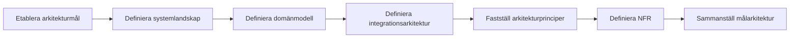

# Processsteg: Målarkitektur

## Syfte

Definiera en tillräcklig målarkitektur för att kunna:
- förstå hur lösningen ska byggas (HUR)
- möjliggöra prioritering och planering (Roadmap)

Fokus är att skapa en sammanhängande och begriplig målbild – inte fullständig teknisk detaljering.

Resultatet är en **förenklad målarkitektur** som beskriver:
- system och komponenter
- centrala begrepp och struktur
- integrationer och beroenden
- tekniska principer och kvalitetskrav

---

## Översiktlig process

---

# Delprocesser och aktiviteter

## Delprocess 2:  Etablera arkitekturell grund

Etablerar den initiala arkitektoniska riktningen genom att definiera mål, principer och en övergripande bild av systemlandskapet.

Innehåll:
- identifiering av arkitekturmål kopplade till verksamhetsbehov
- formulering av initiala arkitekturprinciper
- kartläggning av system, komponenter och beroenden
- översikt av gränssnitt och dataflöden
- validering av arkitektonisk riktning med relevanta intressenter

➡ **Se [SOP 1: Etablera arkitekturell grund](../SOP/2. Målarkitektur/01_etablera_arkitekturell_grund.md).**

---

## Delprocess 2: Definiera domänmodell

Beskriver centrala begrepp och relationer.

Innehåller:
- affärsobjekt
- relationer
- gemensamma definitioner

Syfte:
- skapa en gemensam förståelse mellan verksamhet och teknik

➡ **Se [SOP 2: Definiera domänmodell](../SOP/2. Målarkitektur/02_definiera_domanmodell.md).**

---

## Delprocess 3: Etablera målarkitektur

Etablerar en sammanhängande målarkitektur genom att definiera integrationer, principer och kvalitetskrav samt sammanställa dessa till en helhetsbild.

Innehåller:
- definiering av integrationsarkitektur (mönster, flöden, ansvar)
- fastställande av arkitekturprinciper
- definiering av icke-funktionella krav (NFR)
- sammanställning av målarkitektur
- säkerställande av spårbarhet till krav och behov
- validering och fastställande av arkitekturen

➡ **Se [SOP 3: Etablera målarkitektur](../SOP/2. Målarkitektur/03_etablera malarkitektur.md).**

---

# Resultat från fasen

När fasen är klar ska följande finnas:

- tydliga arkitekturmål
- definierat systemlandskap
- domänmodell
- integrationsarkitektur
- arkitekturprinciper
- NFR

Detta utgör underlag för nästa steg:
→ **Roadmap (prioritering och leveransplanering)**

---

# Viktiga principer

- Tillräcklig detalj – inte maximal detalj
- Fokus på beslut, inte dokumentation
- Struktur före teknikval
- Allt som inte behövs för roadmap tas senare
