# Processsteg: Roadmap / Leveransstrategi

## Syfte
Syftet med denna fas är att definiera **hur lösningen ska byggas och levereras stegvis** så att verksamheten kan börja få värde tidigt.
I denna fas omvandlas den funktionella helhetsbilden från fas 1 och målarkitekturen från fas 2 till en **konkret leveransplan**. Funktionen bryts ned i leveransbara paket som kan utvecklas och tas i bruk successivt.

Målet är att:
- identifiera **MVP (Minimum Viable Product)**
- definiera **leveranspaket / releaser**
- prioritera funktionalitet baserat på värde och risk
- identifiera tekniska beroenden
- skapa en **produktroadmap**

Resultatet ska vara en **tydlig plan för hur produkten levereras stegvis**.

```mermaid
flowchart LR

    %% SEKVENTIELL HUVUDFLÖDE
    A1["Delprocess 1: Skapa MVP"] --> A2["Delprocess 2: Strukturera story map till leveranspaket"]
    A2 --> A3["Delprocess 6: Identifiera tekniska beroenden"]
    A3 --> A4["Delprocess 5: Prioritera funktionalitet"]
    A4 --> A5["Delprocess 3: Skapa releaseplan"]
    A5 --> A6["Delprocess 4: Skapa produktroadmap"]

    %% VISUELL PARALLELLITET
    %% Prioritering kan påbörjas innan beroenden är KLARA, men inte avslutas.
    A3 -. delvis parallellt .-> A4

    %% STYLING
    classDef seq fill:#1e88e5,stroke:#0d47a1,color:#fff;
    classDef par fill:#43a047,stroke:#1b5e20,color:#fff;

    class A1,A2,A3,A4,A5,A6 seq;
```

---

# Delprocesser och aktiviteter

## Delprocess 1: Skapa Roadmap

Framtagning av en sammanhållen plan för hur initiativet ska genomföras över tid.

Delprocessen syftar till att strukturera, prioritera och sekvensera funktionalitet från backlog och målarkitektur till en genomförbar roadmap.

Roadmapen ska:

- definiera en MVP som levererar tidigt verksamhetsvärde
- prioritera funktionalitet baserat på värde, risk och beroenden
- gruppera funktionalitet i logiska leveranspaket
- planera releaser och leveransvågor
- identifiera övergripande beroenden som påverkar genomförandet

Resultatet är en tydlig roadmap som utgör underlag för leverans, implementation och vidare planering.

➡ **Se ../SOP/3. Roadmap/01_skapa_roadmap.md.**

---

## Delprocess 2: Skapa Teknisk plan
Framtagning av en teknisk plan som säkerställer att implementation kan genomföras i rätt ordning utan blockerande beroenden.

Delprocessen syftar till att identifiera, analysera och strukturera tekniska beroenden samt definiera en genomförandeordning för lösningen.

Den tekniska planen ska:

- identifiera beroenden mellan funktionalitet, komponenter och system
- analysera teknisk genomförbarhet utifrån målarkitektur
- definiera en rekommenderad sekvens för implementation
- synliggöra tekniska risker och constraints
- säkerställa att roadmapen är tekniskt genomförbar

Resultatet är en teknisk plan som kompletterar roadmap och används som underlag för implementation och teknisk planering.

Del
➡ **Se ../SOP/3. Roadmap/02_skapa_teknisk_plan.md.**

---

# Resultat från fasen
När fasen är klar ska följande finnas:

- tydligt definierad MVP
- definierade leveranspaket
- prioriterad backlog
- identifierade tekniska beroenden
- releaseplan
- produktroadmap

Detta utgör grunden för nästa fas: **Kontinuerlig leverans**.
