# Processsteg: Leverans / Implementation

## Syfte
Syftet med denna fas är att omsätta roadmapen till fungerande, testad och releasbar funktionalitet.
Fasen ska vara överskådlig: delprocesserna producerar främst några få sammanhållna leverabler i stället för många mellanartefakter.

Varje iteration ska resultera i ett tydligt produktinkrement, verifierat resultat och underlag för nästa steg i processen.

```mermaid
flowchart LR
    A1["Delprocess 1: Backlog refinement"] --> A2["Delprocess 2: Sprintplanering"]
    A2 --> B1["Delprocess 3: Utveckling"]
    B1 --> B2["Delprocess 4: Kodgranskning"]
    B2 --> B3["Delprocess 5: Test"]
    B3 --> C1["Delprocess 6: Integration & bygg"]
    C1 --> D1["Delprocess 7: Demo"]
    D1 --> E1["Delprocess 8: Release"]
    E1 --> F1["Delprocess 9: Deployments"]
    E1 -. parallellt .-> E2["Delprocess 10: Uppdatera dokumentation"]
    F1 -. parallellt .-> E2
    E2 --> G1["Delprocess 11: Uppföljning & förbättring"]
    F1 --> G1
    G1 --> H1["Input till nästa processsteg (Repeat)"]
```

---

# Delprocesser och arbetsmoment

## Delprocess 1: Backlog refinement
Förtydligar och bryter ner kommande arbete så att rätt innehåll kan tas vidare till iterationens planering.

**Huvudleverabel:** underlag till `Sprint backlog`.

➡ **Se ../SOP/4. Leverans/01_backlog_refinement.md.**

---

## Delprocess 2: Sprintplanering
Fastställer iterationens plan, mål och omfattning i en sammanhållen planeringsartefakt.

**Huvudleverabel:** `Sprint backlog`.

➡ **Se ../SOP/4. Leverans/02_sprintplanering.md.**

---

## Delprocess 3: Utveckling
Implementerar funktionalitet enligt user stories, design och arkitektur.

**Huvudleverabel:** arbetsversion av `Produktinkrement`.

➡ **Se ../SOP/4. Leverans/03_utveckling.md.**

---

## Delprocess 4: Kodgranskning
Säkerställer kvalitet, riktlinjer och arkitekturell följsamhet innan funktionalitet går vidare till test.

**Huvudleverabel:** uppdaterat `Produktinkrement`.

➡ **Se ../SOP/4. Leverans/04_kodgranskning.md.**

---

## Delprocess 5: Test
Verifierar att funktionalitet fungerar som avsett och uppfyller acceptanskriterier och kvalitetskrav.

**Huvudleverabler:** `Testresultat` och verifierat `Produktinkrement`.

➡ **Se ../SOP/4. Leverans/05_test.md.**

---

## Delprocess 6: Integration och bygg (CI/CD)
Säkerställer att systemet byggs, integreras och paketeras korrekt i CI/CD-kedjan.

**Huvudleverabel:** releasbart `Produktinkrement`.

➡ **Se ../SOP/4. Leverans/06_integration_och_bygg.md.**

---

## Delprocess 7: Demo
Visar levererad funktionalitet för verksamheten och samlar in den feedback som behövs inför release och förbättringsarbete.

**Huvudleverabler:** uppdaterat `Releasepaket` och underlag till `Förbättringsförslag`.

➡ **Se ../SOP/4. Leverans/07_demo.md.**

---

## Delprocess 8: Release
Paketerar och godkänner releasen för vidare leverans till test-, staging- eller produktionsmiljö.

**Huvudleverabel:** `Releasepaket`.

➡ **Se ../SOP/4. Leverans/08_release.md.**

---

## Delprocess 9: Deployments
Genomför installationer av lösningen i olika miljöer och kompletterar releaseunderlaget med faktisk driftsättningsstatus.

**Huvudleverabler:** uppdaterat `Produktinkrement` och uppdaterat `Releasepaket`.

➡ **Se ../SOP/4. Leverans/09_deployments.md.**

---

## Delprocess 10: Uppdatera dokumentation
Håller teknisk och funktionell dokumentation uppdaterad efter varje leverans.

**Huvudleverabel:** `Dokumentation`.

➡ **Se ../SOP/4. Leverans/10_uppdatera_dokumentation.md.**

---

## Delprocess 11: Uppföljning och förbättring
Konsoliderar lärdomar från demo, release och genomförande till ett sammanhållet förbättringsunderlag.

**Huvudleverabel:** `Förbättringsförslag`.

➡ **Se ../SOP/4. Leverans/11_uppfoljning_och_forbattring.md.**

---

# Resultat från fasen
Denna fas pågår kontinuerligt och resulterar löpande i:

- en fastställd `Sprint backlog`
- ett releasbart `Produktinkrement`
- dokumenterade `Testresultat`
- ett uppdaterat `Releasepaket`
- uppdaterad `Dokumentation`
- samlade `Förbättringsförslag`

Så länge det finns **prioriterade behov i backloggen och finansiering för utveckling** fortsätter denna fas som en iterativ process.