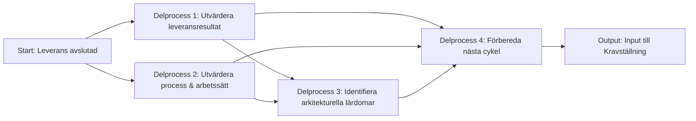

# Processsteg: Repeat / Reflektion & Justering

## Syfte
Syftet med denna fas är att avsluta den genomförda leveransen, samla in lärdomar och förbereda nästa cykel av processen.
Repeat-fasen ska vara lätt att ta till sig: delprocesserna konsoliderar materialet till några få tydliga underlag i stället för att skapa många separata artefakter.

Kravställning → Målarkitektur → Roadmap → Leverans → Repeat → …

Repeat-fasen **uppdaterar inte** roadmap, målarkitektur eller krav i detalj. Den samlar ihop lärdomar, förbättringar och prioriteringssignaler till underlag för nästa cykel.

---

# Delprocesser och aktiviteter

## Delprocess 1: Utvärdera leveransresultat
Sammanställer vad som faktiskt levererades och jämför utfallet med planerat värde, förväntningar och funktionalitet.

**Huvudleverabel:** `Leveransutvärdering`.

➡ **Se [SOP 1: Utvärdera leveransresultat](../SOP/5.%20Repeat/01_utvardera_leveransresultat.md).**

---

## Delprocess 2: Utvärdera process och arbetssätt
Reflekterar över hur teamet arbetade under iterationen och vilka förbättringar som behövs inför nästa cykel.

**Huvudleverabel:** `Processförbättringar`.

➡ **Se [SOP 2: Utvärdera process och arbetssätt](../SOP/5.%20Repeat/02_utvardera_process_och_arbetssatt.md).**

---

## Delprocess 3: Identifiera arkitekturella lärdomar
Identifierar tekniska och arkitekturella insikter som påverkat leveransen och som ska användas i nästa iteration av målarkitekturen.

**Huvudleverabel:** `Arkitekturinsikter`.

➡ **Se [SOP 4: Identifiera arkitekturella lärdomar](../SOP/5.%20Repeat/04_identifiera_arkitekturella_lardomar.md).**

---

## Delprocess 4: Förbereda nästa cykel
Samlar tidigare delresultat, `Roadmap` och `Teknisk plan` i en sammanhållen Business Analyst-sittning inför nästa processcykel.

**Huvudleverabel:** `Cykelstart-brief`.

➡ **Se [SOP 6: Förbereda nästa cykel](../SOP/5.%20Repeat/06_Förbereda%20nästa%20cykel.md).**

---

# Resultat från fasen
När Repeat är avslutat finns:

- en `Leveransutvärdering` som beskriver utfall och värde
- `Processförbättringar` för team och arbetssätt
- `Arkitekturinsikter` som fångar tekniska lärdomar
- en `Cykelstart-brief` som samlar nästa cykels viktigaste input

Fasen leder direkt tillbaka till **Kravställning** i den cirkulära processen.