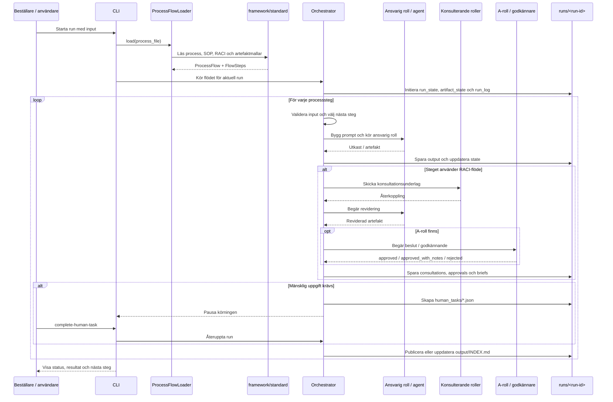

## Processflöde

Detta sekvensdiagram visar **hur en run faktiskt exekveras i dagens lösning**.

Fokus här är inte en idealiserad persona-kedja, utan hur:

- en användare startar en körning
- process och SOP:er laddas från `framework/standard`
- orchestration kör steg för steg
- roller konsulteras och godkänner vid behov
- state, logg och output sparas i `runs/`

## Att tänka på i presentation

- Diagrammet visar **runtime-flödet**, inte hela organisationssamspelet.
- Roller som `Business Analyst`, `UX` eller `Lösningsarkitekt` uppträder här som **ansvariga eller konsulterande roller i ett steg**.
- Samma struktur kan användas både för automatiserade agentroller och för mänskliga handoffs.
- `runs/<run-id>` är navet för spårbarhet: input, output, state, logg, approvals och human tasks.
