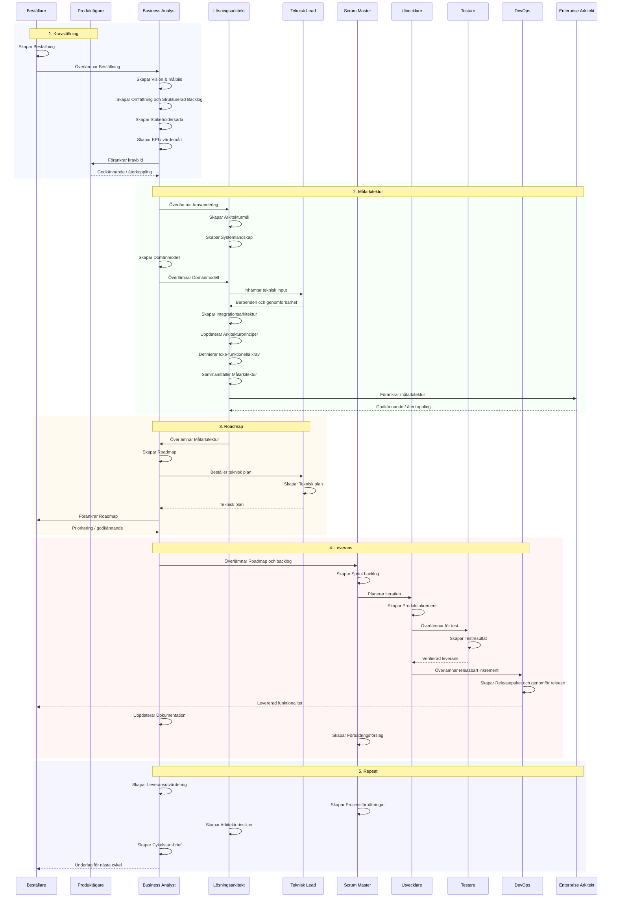

## Processflöde

Detta sekvensdiagram visar **hur roller/agenter tar vid och skapar huvudartefakterna i ordning** genom en hel processcykel.

Det är en förenklad bild som fokuserar på:

- vilken roll som driver nästa steg
- vilka huvudartefakter som skapas
- hur resultat från ett steg blir input till nästa

## Att tänka på i presentation

- Diagrammet visar **process- och artefaktflödet**, inte kodflödet.
- Fokus är på huvudartefakterna, inte alla möjliga mellanleverabler.
- Samma logik kan användas både när rollerna utförs av människor och när de utförs av agenter.
- Den viktiga rörelsen är: **behov -> kravbild -> målarkitektur -> roadmap -> leverans -> lärande -> nästa cykel**.
