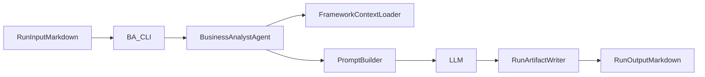

# Plan: Business Analyst Agent MVP

## Goal

Implementera en första fungerande `Business Analyst`-agent enligt [functionality/mvp/01-business-analyst-agent.md](functionality/mvp/01-business-analyst-agent.md), med dessa egenskaper:

- använder Microsoft Agent Framework från start
- läser roll, SOP, RACI och artifaktmallar från `docs/`
- körs via terminal med tydliga BA-kommandon
- använder LLM för att generera innehåll
- sparar runtime-input och output i `runs/`, inte i `docs/`
- byggs i små, verifierbara steg enligt [setup/guidelines/standards.md](setup/guidelines/standards.md)

Föreslagen första vertikala slice:

- input: [runs/demo-001/input/overgripande_behov.md](runs/demo-001/input/overgripande_behov.md)
- styrande SOP: [docs/SOP/1.Kravställning/01_vision_och_malbild.md](docs/SOP/1.Kravställning/01_vision_och_malbild.md)
- roll: [docs/Roller/Business Analyst.md](docs/Roller/Business%20Analyst.md)
- artifaktbeskrivning: [docs/Artifakter/Descriptions/1.Kravställning/Vision & målbild.md](docs/Artifakter/Descriptions/1.Kravställning/Vision%20&%20målbild.md)
- artifaktmall: [docs/Artifakter/Innehåll/1.Kravställning/vision_och_malbild.md](docs/Artifakter/Innehåll/1.Kravställning/vision_och_malbild.md)
- output: `runs/<run-id>/output/vision_och_malbild.md`

## Assumptions

- Python är default för implementationen eftersom repoets miljö och befintlig kod är Python-orienterad enligt [setup/environment/development-environment.md](setup/environment/development-environment.md).
- `docs/` är source of truth för roller, SOP:er, RACI och mallar. Agenten får läsa därifrån men ska inte skriva genererade resultat dit.
- `runs/` är arbetsyta för körningar och ska användas för input, output och enkel filbaserad state.
- Första körbara scenario fokuserar på `generate` för en artefakt, inte hela Kravställning-flödet på en gång.
- `list` bör implementeras före `generate`, så att dokumentupptäckt och ansvarsmappning kan verifieras utan LLM.
- `update` byggs efter att `generate` fungerar och utgår initialt från enkel omskrivning av befintlig output baserat på nytt inputunderlag.

## Proposed File Changes

Nya filer eller mappar att införa, i denna ordning:

- [src/agents/business_analyst/](src/agents/business_analyst/) för agentlogik
- [src/agents/business_analyst/agent.py](src/agents/business_analyst/agent.py) som tunn MAF-agent för BA
- [src/agents/business_analyst/context_loader.py](src/agents/business_analyst/context_loader.py) för att läsa roll, SOP, RACI, artifaktbeskrivning och mall
- [src/agents/business_analyst/prompt_builder.py](src/agents/business_analyst/prompt_builder.py) för att bygga LLM-prompt från framework-filer + run-input
- [src/orchestration/business_analyst_flow.py](src/orchestration/business_analyst_flow.py) för explicit stegsekvens `list`, `generate`, `update`
- [src/capabilities/run_workspace.py](src/capabilities/run_workspace.py) för run-paths, filupptäckt, läs/skriv och enkel versionshantering
- [src/cli/ba.py](src/cli/ba.py) för terminalkommandon som `BA list`, `BA generate`, `BA update`
- [tests/agents/test_business_analyst_context_loader.py](tests/agents/test_business_analyst_context_loader.py) för återanvändbar dokumenttolkning
- [tests/orchestration/test_business_analyst_flow.py](tests/orchestration/test_business_analyst_flow.py) för första verifierbara flödet
- [README.md](README.md) eller [setup/README.md](setup/README.md) för kort användningssektion när första flowet fungerar

Filer som ska användas som styrande indata, inte ändras av agentens runtime:

- [docs/Roller/Business Analyst.md](docs/Roller/Business%20Analyst.md)
- [docs/RACI/1. Kravställning.md](docs/RACI/1.%20Kravställning.md)
- [docs/SOP/1.Kravställning/01_vision_och_malbild.md](docs/SOP/1.Kravställning/01_vision_och_malbild.md)
- [docs/SOP/1.Kravställning/02_affarsmal_och_vardebild.md](docs/SOP/1.Kravställning/02_affarsmal_och_vardebild.md)
- [docs/Artifakter/Descriptions/1.Kravställning/Vision & målbild.md](docs/Artifakter/Descriptions/1.Kravställning/Vision%20&%20målbild.md)
- [docs/Artifakter/Innehåll/1.Kravställning/vision_och_malbild.md](docs/Artifakter/Innehåll/1.Kravställning/vision_och_malbild.md)

## Step-by-step TODO List

1. Verifiera teknisk grund för Microsoft Agent Framework i Python-miljön.
   Verifierbart resultat: ett minimalt proof-of-life i `src/` som visar att vald MAF-SDK kan initieras i repoets miljö utan att påverka övrig struktur.
2. Skapa minimal projektstruktur för BA-agenten under `src/` utan att bygga generell multi-agent-arkitektur.
   Verifierbart resultat: tomma men körbara moduler för agent, orchestration, CLI och run workspace kan importeras utan fel.
3. Implementera `run workspace`-lagret för filbaserad state i `runs/`.
   Verifierbart resultat: givet en run-mapp kan koden hitta `input/`, skapa `output/` vid behov och läsa/skriva markdownfiler deterministiskt.
4. Implementera dokumentupptäckt för BA-agentens styrande kontext.
   Verifierbart resultat: agenten kan läsa rollfilen, RACI för `1. Kravställning`, relevanta SOP-filer och artifaktbeskrivning/mall för `Vision & målbild`.
5. Implementera ansvarsmappning och kommandot `BA list`.
   Verifierbart resultat: kommandot listar vilka SOP:er i `1.Kravställning` där `Business Analyst` är `R`, samt vilka artefakter som därmed är kandidat-output för agenten.
6. Implementera promptbyggaren för första artefakten `Vision & målbild`.
   Verifierbart resultat: givet `overgripande_behov.md` + roll + SOP + beskrivning + mall kan systemet skapa en komplett, inspekterbar prompt utan hårdkodad artefakttext.
7. Implementera första end-to-end-kommandot `BA generate` för `Vision & målbild` via MAF + LLM.
   Verifierbart resultat: givet `runs/demo-001/input/overgripande_behov.md` skapas `runs/demo-001/output/vision_och_malbild.md` som följer mallens rubriker och sparas som markdown.
8. Lägg till enkel spårbarhet i output och run-state.
   Verifierbart resultat: genererad artefakt eller tillhörande metadata visar vilken SOP, roll, inputfil och tidpunkt som användes för körningen.
9. Implementera `BA update` för samma artefakt med minimal logik.
   Verifierbart resultat: om inputfilen ändras kan kommandot regenerera eller skriva över befintlig output på ett kontrollerat sätt, utan dold magi.
10. Utöka från första slice till nästa BA-steg först efter verifierad baseline.
    Verifierbart resultat: välj nästa SOP med korrekt input/output-mappning, helst [docs/SOP/1.Kravställning/02_affarsmal_och_vardebild.md](docs/SOP/1.Kravställning/02_affarsmal_och_vardebild.md) om dess outputdefinition bekräftas, annars nästa tydliga BA-SOP i kedjan.
11. Lägg till fokuserade tester för återanvändbar logik och en kort användningsbeskrivning.
    Verifierbart resultat: dokumentupptäckt, promptbyggnad och run workspace har tester där det ger värde, och README/setup beskriver hur första BA-flödet körs.

## First Minimal Working Scenario

Scenario som ska användas som första kontrollpunkt:

1. Använd `runs/demo-001/input/overgripande_behov.md` som input.
2. Kör `BA list` och verifiera att `Vision & målbild` identifieras som en BA-ansvarad artefakt i Kravställning.
3. Kör `BA generate` för `Vision & målbild`.
4. Verifiera att output skrivs till `runs/demo-001/output/vision_och_malbild.md`.
5. Kontrollera att output:

- följer rubrikerna i artefaktmallen
- använder innehåll från inputfilen
- refererar till rätt SOP/roll i metadata eller körlogg

När detta fungerar finns en riktig MVP-baseline för att lägga till `update` och fler SOP:er.

## Risks / Open Questions

- Microsoft Agent Framework kan kräva ett SDK-val eller versionsval som ännu inte är fastslaget i repot. Därför ska integrationsytan hållas tunn bakom `agent.py`.
- Det finns en dokumentinkonsistens i [docs/SOP/1.Kravställning/02_affarsmal_och_vardebild.md](docs/SOP/1.Kravställning/02_affarsmal_och_vardebild.md), där output idag ser ut att peka på `Vision & målbild`. Detta bör bekräftas innan steg 10 implementeras.
- RACI-filen under [docs/RACI/1. Kravställning.md](docs/RACI/1.%20Kravställning.md) innehåller både artefaktlista och diagram, så ansvarsmappningen bör baseras på tydliga tabell-/SOP-källor och inte på fri tolkning av mermaid-block.
- Första versionen bör undvika generell agentplattform, minneslager eller multi-agent-orkestrering. Endast BA-scenariot ska göras robust först.
- LLM-output måste hållas mallstyrd men inte hårdkodad; prompten ska bygga på repoets dokument snarare än statisk stränglogik.
- `runs/` får aldrig bli permanent repo-dokumentation eller blandas ihop med källfiler under `docs/`.

## Recommended Execution Order

- Börja med TODO 1-5 för att säkra struktur, dokumentupptäckt och ansvarsmappning.
- Implementera därefter endast TODO 6-7 som första verkliga leverans.
- Stanna och verifiera innan TODO 8-11 tas vidare.
