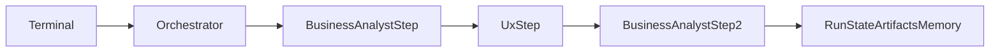

# Agent Orchestration MVP Plan

## Rekommenderad första slice

Fokusera första implementationen på ett smalt men verkligt fleragentflöde: `Business Analyst -> UX -> Business Analyst`.

Det är den minsta rimliga vägen som redan stöds av repo-strukturen:

- [functionality/mvp/02-agent-orchestration-framework.md](functionality/mvp/02-agent-orchestration-framework.md) kräver 1 orchestrator, 2 agentroller, explicita artifakter, filbaserad state och terminalkörning.
- [src/orchestration/business_analyst_flow.py](src/orchestration/business_analyst_flow.py) visar att det redan finns en fungerande BA-kedja att migrera från.
- [src/agents/business_analyst/context_loader.py](src/agents/business_analyst/context_loader.py) och [src/agents/business_analyst/artifact_registry.py](src/agents/business_analyst/artifact_registry.py) innehåller logik som bör generaliseras i stället för att skrivas om från noll.
- [docs/SOP/1.Kravställning/06_user_journeys.md](docs/SOP/1.Kravställning/06_user_journeys.md) och [docs/SOP/1.Kravställning/07_skapa_story_map.md](docs/SOP/1.Kravställning/07_skapa_story_map.md) ger ett naturligt flöde där UX producerar `User journeys` som BA sedan använder vidare.

## Varför denna ordning

Nuvarande implementation blandar flera ansvar i samma BA-specifika flöde: docs-laddning, artifact-registrering, körlogik, LLM-anrop och run-loggning. Nästa steg bör därför börja med att extrahera generella kontrakt och en tydlig orkestreringsyta innan fler roller läggs till.

Microsoft Agent Framework bör isoleras bakom en tunn integrationsyta. Microsofts dokumentation beskriver agents, workflows, agent session/state och att Python-stödet fortfarande är i public preview. Planen bör därför hålla MAF-beroendet lokalt i en adapter i stället för att sprida preview-API:er genom hela `src/`.

## Implementationsordning

1. Lås första MVP-flödet som kontrakt, inte som generell plattform. Definiera exakt vilka steg, vilka input-artifakter och vilka output-artifakter som skall ingå i första körbara kedjan.
2. Extrahera generella modeller för `AgentDefinition`, `ArtifactRecord`, `RunState`, `ArtifactState` och `AgentMemory`. De ska kunna representera både BA och UX utan hårdkodade BA-antaganden.
3. Generalisera docs-laddning så att agenter, SOP:er, artifact-beskrivningar och mallar kan hämtas roll-oberoende från `docs/`.
4. Inför filbaserade stores för run state, artifact state, minne och körlogg under `runs/<run-id>/` med läsbara JSON- eller markdownfiler.
5. Lägg in en tunn MAF-adapter som kapslar hur Python-agenter skapas och hur ett enkelt workflow körs. Ingen annan del av systemet ska bero direkt på preview-detaljer.
6. Bygg en central orchestrator som: validerar input, väljer körbara steg, kör agent via MAF, sparar output, uppdaterar state och avgör nästa steg.
7. Migrera nuvarande `Business Analyst` så att den körs via orchestratorn i stället för via en separat BA-flow-klass.
8. Lägg till en första UX-agent på samma gemensamma kontrakt och koppla in den i kedjan mellan två BA-steg.
9. Ersätt BA-specifik terminalinteraktion med ett gemensamt CLI för att lista agenter, starta run, visa status och förklara stopp/skips.
10. Verifiera med ett end-to-end-demo i `runs/` och lägg bara till fokuserade tester kring återanvändbar logik, inte kring själva LLM-texten.

## Troliga ändringsytor

- Generalisera eller ersätt [src/orchestration/business_analyst_flow.py](src/orchestration/business_analyst_flow.py) med en central orchestrator och tydlig flow-definition.
- Bryt ut återanvändbar docs- och artifact-logik från [src/agents/business_analyst/context_loader.py](src/agents/business_analyst/context_loader.py) och [src/agents/business_analyst/artifact_registry.py](src/agents/business_analyst/artifact_registry.py).
- Behåll [src/capabilities/run_workspace.py](src/capabilities/run_workspace.py) som grund, men utöka den till explicita state- och memory-stores.
- Återanvänd LLM-konfigurationen i [src/agents/business_analyst/agent.py](src/agents/business_analyst/agent.py), men lägg MAF-integrationen bakom en separat adapter.
- Ersätt eller komplettera [src/cli/ba.py](src/cli/ba.py) med ett ramverks-CLI i stället för rollspecifik CLI.

## Verifieringspunkter per steg

- Efter kontraktssteget: det finns en tydlig lista över MVP-steg, input, output och ansvarig agent.
- Efter modell- och loader-steget: BA och UX kan laddas från `docs/` via samma kodväg.
- Efter state-steget: varje steg lämnar läsbar status i `runs/<run-id>/`.
- Efter MAF-adaptern: ett enkelt agentanrop fungerar utan att orchestratorn känner till provider-detaljer.
- Efter orchestratorn: systemet kan avgöra `run`, `skip`, `stop` deterministiskt.
- Efter migreringen: BA kan köras via det nya ramverket.
- Efter UX-integrationen: output från en agent används som input till nästa i samma run.
- Efter CLI-steget: hela flödet kan köras från terminal utan BA-specialkod.
